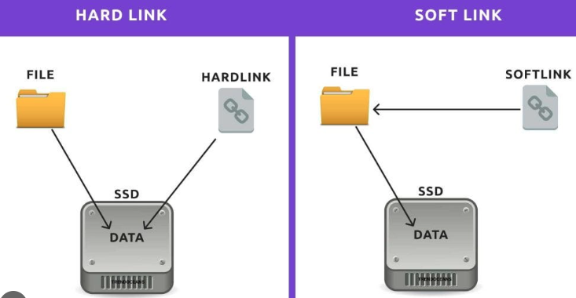
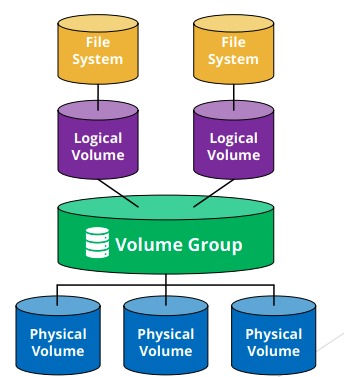

# Disk, Storage, and LVM

# Overview
- Linux storage is abstracted in layers: physical disks → partitions → (optional) LVM logical volumes → filesystem.
- LVM adds a flexible management layer between partitions and filesystems, enabling resize and snapshots without downtime.
- RAID combines multiple disks for performance (RAID 0), redundancy (RAID 1/5/6), or both (RAID 10).

# Architecture

```text
Application  (read/write files)
        |
        v
Filesystem   (ext4, xfs — organises data)
        |
        v
Block device (LV or raw partition — /dev/mapper/vg-lv or /dev/sdb1)
        |
        v
LVM          (optional: PV → VG → LV)
        |
        v
RAID / mdadm (optional: stripes/mirrors across physical disks)
        |
        v
Physical disk (/dev/sda, /dev/sdb, /dev/nvme0n1)
```

# Core Building Blocks

### Partitioning

### Swap
- **What it is** — Swap is virtual memory on disk. Used when RAM is full. Slower than RAM.

```bash
free -h                     # show RAM and swap usage
swapon --show               # show active swap devices

mkswap /dev/sdX1            # prepare partition as swap
swapon /dev/sdX1            # enable swap
swapoff /dev/sdX1           # disable swap
```

- Swap is virtual memory on disk — used when RAM is exhausted.
- Add to `/etc/fstab` for permanent swap: `UUID=... none swap sw 0 0`
- Swap on SSD is fast but wears the drive — prefer adding RAM over heavy swap usage.

### Links
- **What it is** — Link creates another reference to a file. Two types: Hard Link and Soft Link (Symbolic Link).



#### Hard link

```bash
ln <source_file> <hard_link_name>
```
- Creates another name for the same file.
- Shares the same inode.
- If original file is deleted, hard link still works.
- Use `ls -li` to check innode(number in first column). If inode number is same → hard link.
- Cannot link directories.

#### Soft link

```bash
ln -s <source_file> <hard_link_name>
```
- Creates a shortcut to the original file.
- Has different inode.
- Points to file path, not inode.
- If original file is deleted, link becomes broken.
- `-f` → force
- `-n` it treats the symlink itself as a normal file and replaces it. With not it may try to modify what it point to.

### Disk Usage

```bash
df -h                       # filesystem usage (space per mount point)
df -i                       # inode usage
du -sh <dir>                # size of directory
du -sh * | sort -rh | head  # top directories by size
```
- `df -h` shows space; `df -i` shows inodes — both can independently reach 100%.

### LVM (Logical Volume Manager)
- **Why it exists** — Resize partitions easily. Combine multiple disks into one volume. Take snapshots. Better flexibility than traditional partitions.
- **What it is** — a storage management system in Linux. Abstracts physical disks into logical storage.

#### Components of LVM
- LVM has 3 main layers
- Physical Volume (PV) Physical disk or partition prepared for LVM.
  - Volume Group (VG) Pool of storage created from one or more PVs.
  - Logical Volume (LV) Virtual partition created from VG. This is what you
    format and mount.



- Flow `Disk → PV → VG → LV → mkfs → mount`

#### How to Check LVM
```bash
# inspect
pvs                         # physical volumes summary
vgs                         # volume groups summary
lvs                         # logical volumes summary
pvdisplay                   # physical volumes detailed view
vgdisplay                   # volume groups detailed view
lvdisplay                   # logical volumes detailed view
```

#### Create LVM or Extend

```bash
pvcreate [partition-prepare-for-LVM]    # initialise partition as PV
vgcreate [vg-name] [partiion]           # create VG from PV
lvcreate -L 5G -n [lv_name] [vg_name]   # create 10G LV named lv_data

# extend
vgextend vg_data /dev/sdc1
lvextend -L +5G /dev/vg_data/lv_data
resize2fs /dev/vg_data/lv_data      # ext4
xfs_growfs /mountpoint              # xfs (mounted)
```

- LVM resize workflow: `pvcreate → vgextend → lvextend → resize2fs/xfs_growfs`.
- `xfs_growfs` requires the filesystem to be mounted; `resize2fs` works unmounted.

#### To resize the existing LVM disk

- see the following [resize-existing](../Shell-script/Disk/resize-existing-lvm.sh)

### RAID
- **Why it exists** — combine multiple physical disk to get more performance or more high availability.
- **What it is** — Redundant Array of Independent Disks (RAID).

#### RAID 0

- Combine Disk A and Disk B `Disk A | Disk B`write data in 2 disk independently to get more speed.
- Data is striped across disks (split into blocks and written in parallel).
- Tolerate 0 disk fail. 100% of total disk space. No redundancy.

#### RAID 1

- Mirror Disk A and Disk B `Disk A = Disk B` write same data on 2 disk to get more high availability.
- Tolerate 1 disk fail. 50% usable of total disk space.

#### RAID 5

- Single parity block (3 disk minimum). Tolerate 1 disk fail.
- Uses block-level striping with distributed parity. (N − 1) usable of total disk space.

| Disk 1 | Disk 2 | Disk 3 | Data write |
| :----: | :----: | :----: | :--------: |
|   A    |   B    |   P    |  1 write   |
|   C    |   P    |   D    |  2 write   |
|   P    |   E    |   F    |  3 write   |

- `P = A xor B` if A missing can get back from `A = P xor B`
- Write performance is slower than RAID 0/1 (parity calculation required).

#### RAID 6

- Two independent parity block (4 disk minimum). Tolerate 2 disk fail.
- (N − 2) usable of total disk space. Slower writes than RAID 5.

#### RAID 10

- Combine and mirror `(Disk A = Disk B) | (Disk C = Disk D)` to get more high availability and more speed(4 disk minimum).
- each pair can fail 1 disk. 50% usable of total disk space.

#### Summary Table

| RAID  | Min Disks | Fault Tolerance | Usable Capacity | Performance |
| :---: | :-------: | :-------------: | :-------------: | :---------: |
|   0   |     2     |        0        |      100%       |  Very High  |
|   1   |     2     |  1 per mirror   |       50%       |  High Read  |
|   5   |     3     |        1        |       N-1       |  Good Read  |
|   6   |     4     |        2        |       N-2       |  Good Read  |
|  10   |     4     |  1 per mirror   |       50%       |  Very High  |

[Software-RAID-linux](../Shell-script/Disk/software-raid.sh)

### Ceph (Distributed Storage)
- **What it is** — Software define storage platform that providers block, object, File storage from cluster of server into one logical storage system.

- Core Concept
  - Ceph turns many physical servers into one combine distributed storage system
  - Data is distributed
  - Data is replicated
  - No single point of failure
  - Scales horizontally (just add more nodes)
