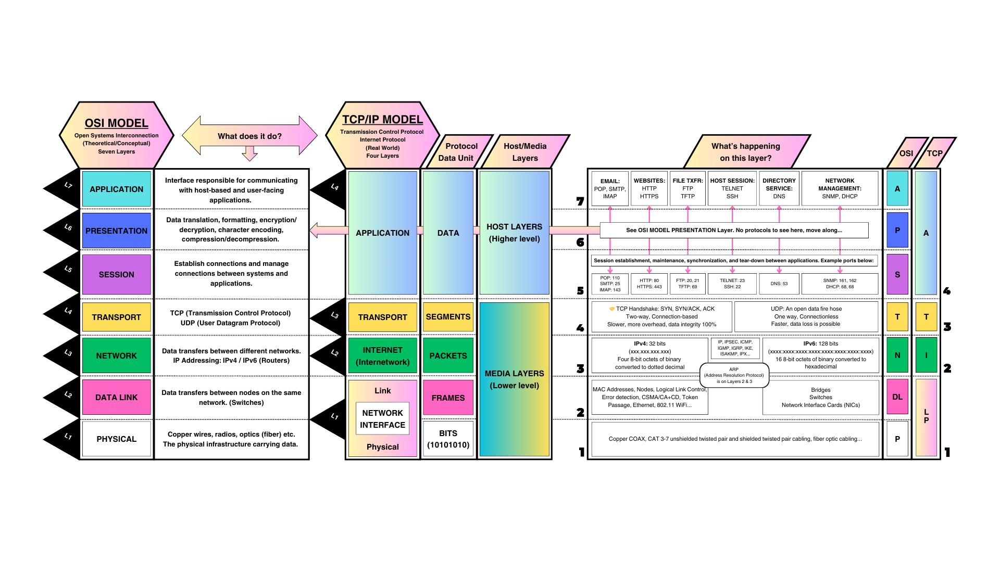

# Network Models

- Network models split communication into layers, each with a clear responsibility.
- The OSI model (7 layers) is used for learning and design; the TCP/IP model (4 layers) is used in practice.
- Encapsulation adds headers as data moves down the stack; de-encapsulation removes them on the way up.

# Architecture



```text
        OSI Model (7 layers)              TCP/IP Model (4 layers)
  +---------------------------+     +---------------------------+
  | 7  Application            |     |                           |
  +---------------------------+     |       Application         |
  | 6  Presentation           |     |  (HTTP, DNS, SSH, TLS)    |
  +---------------------------+     |                           |
  | 5  Session                |     +---------------------------+
  +---------------------------+     |       Transport           |
  | 4  Transport              |     |      (TCP, UDP)           |
  +---------------------------+     +---------------------------+
  | 3  Network                |     |       Internet            |
  +---------------------------+     |    (IP, ICMP, IPsec)      |
  | 2  Data Link              |     +---------------------------+
  +---------------------------+     |         Link              |
  | 1  Physical               |     | (Ethernet, Wi-Fi, phys.) |
  +---------------------------+     +---------------------------+
```

# Mental Model

```text
Sending data (encapsulation):

  Application:  "GET / HTTP/1.1"
       |
       v  + TCP header
  Transport:  [TCP hdr]["GET / HTTP/1.1"]
       |
       v  + IP header
  Network:    [IP hdr][TCP hdr]["GET / HTTP/1.1"]
       |
       v  + Ethernet header + trailer
  Data Link:  [Eth hdr][IP hdr][TCP hdr]["GET / HTTP/1.1"][Eth trl]
       |
       v  converted to signals
  Physical:   bits on cable / Wi-Fi


Receiving data (de-encapsulation):

  Physical:   bits from cable / Wi-Fi
       |
       v  strip Ethernet header/trailer
  Data Link:  [IP hdr][TCP hdr]["GET / HTTP/1.1"]
       |
       v  strip IP header
  Network:    [TCP hdr]["GET / HTTP/1.1"]
       |
       v  strip TCP header
  Transport:  "GET / HTTP/1.1"
       |
       v
  Application receives data
```

```text
Example: opening https://example.com

1. Application: browser prepares DNS lookup, then HTTPS request
2. Transport:   TCP connection opens to port 443 (3-way handshake)
3. Network:     IP packet is routed toward the destination
4. Data Link:   frame is sent to next-hop MAC (usually the gateway)
5. Physical:    bits travel over cable, fiber, or Wi-Fi
```

# Core Building Blocks

### OSI Model (7 Layers)

| Layer | Name         | Role                              | What it does                                                |
| :---: | :----------- | :-------------------------------- | :---------------------------------------------------------- |
|   7   | Application  | Closest to user applications      | Provides network services to apps (web, email, DNS)         |
|   6   | Presentation | Data format and translation       | Converts formats, encrypts/decrypts, compresses data        |
|   5   | Session      | Conversation control              | Starts, maintains, and ends communication sessions          |
|   4   | Transport    | End-to-end delivery               | Segments data, uses ports, handles reliability and flow     |
|   3   | Network      | Logical addressing                | Uses IP addressing and routing between networks             |
|   2   | Data Link    | Local delivery                    | Uses MAC addressing, framing, and local error detection     |
|   1   | Physical     | Hardware signals                  | Sends bits as electrical, optical, or radio signals         |

- OSI = 7 layers (conceptual, for learning/design); TCP/IP = 4 layers (practical, used on the internet).
- Troubleshoot bottom-up: physical first, then link, network, transport, application.
- A packet traverses every layer twice: once at sender (down), once at receiver (up).

Related notes: [005-transport-layer](./005-transport-layer.md), [003-addressing-and-routing](./003-addressing-and-routing.md)

### OSI Layers with Protocol Examples

| Layer | Protocols / Technologies                                | Devices / Functions                               |
| :---: | :------------------------------------------------------ | :------------------------------------------------ |
|   7   | HTTP/HTTPS, DNS, SMTP, SSH                              | Web server, DNS resolver, application gateway     |
|   6   | TLS/SSL, UTF-8, JPEG                                    | Encryption engines, data format translation       |
|   5   | RPC, session control in app protocols                   | Session setup/teardown, dialog control            |
|   4   | TCP, UDP                                                | Firewall rules by port, L4 load balancer          |
|   3   | IPv4/IPv6, ICMP, IPsec                                  | Router, L3 switch, routing table decisions        |
|   2   | Ethernet (802.3), Wi-Fi MAC (802.11), ARP, VLAN (802.1Q)| Switch, bridge, MAC table forwarding              |
|   1   | Copper, fiber, radio                                    | Cables, transceivers, hubs, signal repeaters      |

Related notes: [009-tls-and-ssl-cert-chain](./009-tls-and-ssl-cert-chain.md), [008-http-https](./008-http-https.md)

### TCP/IP Model (4 Layers)

- **Application** -- combines OSI layers 7, 6, 5. Protocols: HTTP, HTTPS, DNS, SMTP, SSH, TLS. This is where browsers, mail clients, and SSH clients interact.
- **Transport** -- end-to-end communication between processes using port numbers. TCP for reliable ordered delivery; UDP for fast connectionless delivery.
- **Internet** -- logical addressing and routing between networks. IP, ICMP, IPsec. Routers examine destination IP to decide next hop.
- **Link** -- local network communication using frames and MAC addresses. Includes Ethernet, Wi-Fi, and the physical medium. Switches operate here.
- TCP/IP Application layer combines OSI layers 7, 6, and 5.

Related notes: [005-transport-layer](./005-transport-layer.md), [003-addressing-and-routing](./003-addressing-and-routing.md)

### OSI to TCP/IP Mapping

| TCP/IP Layer | Maps to OSI | Typical Protocols               |
| :----------- | :---------- | :------------------------------ |
| Application  | 7, 6, 5    | HTTP, DNS, SMTP, SSH, TLS       |
| Transport    | 4           | TCP, UDP                        |
| Internet     | 3           | IP, ICMP, IPsec                 |
| Link         | 2, 1        | Ethernet, Wi-Fi, physical media |

- Encapsulation: data gets headers added going down; de-encapsulation strips them going up.

Related notes: [000-core](./000-core.md)

### PDU Names by Layer

- PDU (Protocol Data Unit) names identify data at each layer.

| Layer Scope                        | PDU Name                       |
| :--------------------------------- | :----------------------------- |
| Application / Presentation / Session | Data                         |
| Transport                          | Segment (TCP) / Datagram (UDP) |
| Network                            | Packet                         |
| Data Link                          | Frame                          |
| Physical                           | Bits                           |

- PDU names: Data, Segment/Datagram, Packet, Frame, Bits (top to bottom).

Related notes: [005-transport-layer](./005-transport-layer.md)

### Devices by Layer
Related notes: [010-proxy-and-load-balancing](./010-proxy-and-load-balancing.md)
- Layer 1 (Physical): cable, repeater, hub, transceiver
- Layer 2 (Data Link): switch, bridge
- Layer 3 (Network): router, Layer 3 switch
- Layer 4-7 (Transport-Application): firewall, proxy, load balancer, gateway
- L2 devices (switches) use MAC addresses; L3 devices (routers) use IP addresses.


---

# Troubleshooting Guide

```text
Start: identify which layer is failing
    |
    v
[L1] Physical -- cable connected? interface up?
    ip link show / ethtool <iface>
    |  ok
    v
[L2] Data Link -- VLAN correct? MAC table populated? ARP resolving?
    ip neigh show / bridge fdb show
    |  ok
    v
[L3] Network -- IP assigned? subnet correct? gateway reachable? route exists?
    ip addr / ping <gw> / ip route
    |  ok
    v
[L4] Transport -- port open? TCP handshake completing? UDP response?
    ss -tulnp / nc -zv <host> <port>
    |  ok
    v
[L7] Application -- DNS resolving? correct response? auth working?
    dig <domain> / curl -v <url>
```
