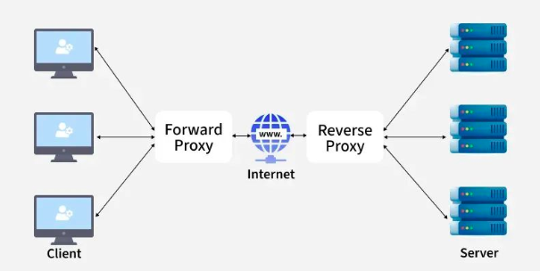

# Proxy and Load Balancing

- A proxy is an intermediary server between client and destination that can provide caching, filtering, anonymity, or access control.
- A forward proxy acts on behalf of clients; a reverse proxy acts on behalf of servers (hiding backends, terminating SSL, load balancing).
- Load balancing distributes traffic across multiple backend servers using algorithms like round robin, least connections, or IP hash.

# Architecture


```text
Forward Proxy:
  +--------+     +---------------+     +----------+     +--------+
  | Client | --> | Forward Proxy | --> | Internet | --> | Server |
  +--------+     +---------------+     +----------+     +--------+
  (knows proxy)   (hides client)

Reverse Proxy / Load Balancer:
                                        +------------+
                                   +--> | Backend #1 |
  +--------+     +---------------+ |    +------------+
  | Client | --> | Reverse Proxy |-+
  +--------+     | (Load Balancer)|-+    +------------+
  (sees proxy    +---------------+ +--> | Backend #2 |
   as server)                      |    +------------+
                                   |
                                   |    +------------+
                                   +--> | Backend #3 |
                                        +------------+
```

# Mental Model

```text
Client request arrives
  |
  v
Is there a proxy?
  |
  +--> Forward proxy (client-side)
  |       |
  |       v
  |     Proxy evaluates: allowed? cached?
  |       |
  |       +--> blocked --> return error to client
  |       +--> cached  --> return cached response
  |       +--> forward --> send to destination server
  |
  +--> Reverse proxy (server-side)
          |
          v
        Terminate SSL? --> yes --> decrypt, then forward plain HTTP to backend
          |
          v
        Select backend (load balancing algorithm)
          |
          v
        Health check: backend alive?
          |
          +--> yes --> forward request
          +--> no  --> pick next healthy backend
          |
          v
        Return response to client
```

Example: nginx as reverse proxy with load balancing:

```nginx
upstream backends {
    least_conn;
    server 10.0.0.1:8080;
    server 10.0.0.2:8080;
    server 10.0.0.3:8080;
}

server {
    listen 443 ssl;
    server_name example.com;

    ssl_certificate     /etc/nginx/ssl/cert.pem;
    ssl_certificate_key /etc/nginx/ssl/key.pem;

    location / {
        proxy_pass http://backends;
        proxy_set_header Host $host;
        proxy_set_header X-Real-IP $remote_addr;
    }
}
```

# Core Building Blocks

### Forward Proxy

- Client explicitly configures the proxy (browser settings, `http_proxy` env var).
- Client knows it is using a proxy.
- Use cases:
  - Hide client IP / anonymity
  - Bypass geo-restrictions
  - Corporate web filtering and access control
  - Caching frequently accessed content
- Examples: Squid, corporate HTTP proxies

```text
Client --> Forward Proxy --> Internet --> Server
```

Related notes: [005-http-https](./005-http-https.md), [008-ipsec-vpn](./008-ipsec-vpn.md)

### Reverse Proxy

- Sits in front of one or more backend servers.
- Client does not know backend servers exist; it sees the proxy as the server.
- Use cases:
  - Load balancing across backends
  - SSL/TLS termination
  - Caching and compression
  - Hiding backend topology and IPs
  - Rate limiting, WAF
- Examples: nginx, HAProxy, Envoy, Traefik

```text
Client --> Reverse Proxy --> Backend Server(s)
```

Related notes: [005-http-https](./005-http-https.md), [006-TLS-and-SSL-cert-chain](./006-TLS-and-SSL-cert-chain.md)
- Reverse proxy: server-side, hides backend servers, client is unaware.
- SSL termination at the reverse proxy offloads encryption from backends.
- nginx, HAProxy, Envoy, and Traefik are common reverse proxy / load balancer tools.

### Forward vs Reverse Proxy

| Forward Proxy              | Reverse Proxy                |
| :------------------------- | :--------------------------- |
| Client-side                | Server-side                  |
| Hides client identity      | Hides server identity        |
| Client configures proxy    | Server admin configures      |
| Access control, filtering  | Load balancing, SSL, caching |
| Client aware of proxy      | Client unaware of backends   |

Related notes: [008-ipsec-vpn](./008-ipsec-vpn.md)
- Forward proxy: client-side, hides client identity, client is aware.

### Load Balancing Algorithms

- **Round Robin** -- sends each request to the next server in order; simple, even distribution
- **Least Connections** -- sends to the server with fewest active connections; best when request durations vary
- **IP Hash** -- same client IP always routes to same backend; provides session affinity
- **Weighted Round Robin / Weighted Least Connections** -- assigns more traffic to more powerful servers based on configured weights

Related notes: [005-http-https](./005-http-https.md)
- Load balancing distributes traffic to improve availability, scalability, and performance.
- Common algorithms: round robin, least connections, IP hash, weighted variants.

### Health Checks

- Load balancer periodically probes backends to verify they are alive.
- Unhealthy servers are removed from the pool; re-added when healthy.
- Common check types:
  - **HTTP** -- request a health endpoint, expect 200 OK
  - **TCP** -- verify port is open and accepting connections
  - **Custom script** -- run application-specific checks

Related notes: [005-http-https](./005-http-https.md)
- Health checks remove unhealthy backends from the pool automatically.

### Load Balancer Components
- **Load balancer** -- reverse proxy that distributes traffic
- **Backend pool** -- group of servers receiving traffic
- **Health check configuration** -- probe interval, timeout, thresholds
- **Algorithm selection** -- determines how requests are distributed
- A load balancer is typically implemented as a reverse proxy.
---

# Troubleshooting Guide

```text
Traffic not reaching backends?
  |
  +--> Can client reach load balancer?
  |       |
  |       +--> no  --> DNS / firewall / LB not listening
  |       +--> yes --> continue
  |
  +--> Are backends healthy?
  |       |
  |       +--> Check health check logs / status page
  |       +--> All backends down? --> check backend services
  |       +--> Partial --> check failing backend logs
  |
  +--> Requests arriving but failing?
  |       |
  |       +--> 502 Bad Gateway --> backend not responding or crashed
  |       +--> 504 Gateway Timeout --> backend too slow
  |       +--> 503 Service Unavailable --> no healthy backends
  |
  +--> Session issues (user gets logged out)?
          |
          +--> Using round robin? --> switch to IP hash or sticky sessions
          +--> Cookie-based affinity configured? --> check cookie settings
```
