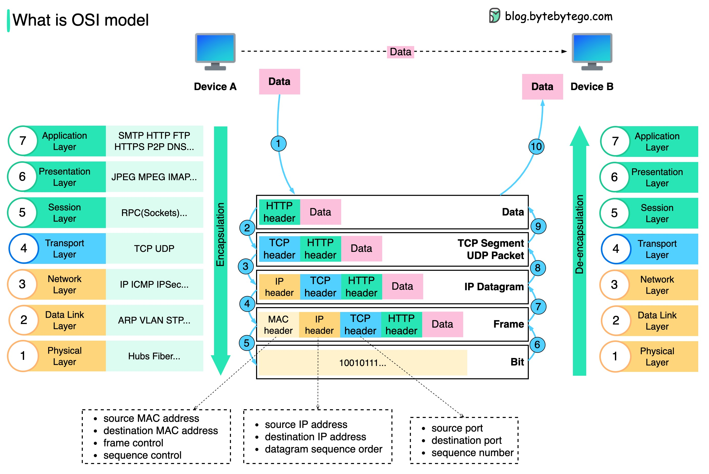

# Network Models

# Overview

- **Why it exists** — standard protocol for communication over network
- **What is it** - is a theoretical framework that divides communication into 7 layers each with a specific function.
- it uses the concept of Encapsulation which adds headers as data moves down the stack; de-encapsulation removes them on the way up.

# Architecture



# OSI Model (7 Layers)

- Open Systems Interconnection model

| Layer | Name         | Role                         | What it does                                            |
| :---: | :----------- | :--------------------------- | :------------------------------------------------------ |
|   7   | Application  | Closest to user applications | Provides network services to apps (web, email, DNS)     |
|   6   | Presentation | Data format and translation  | Converts formats, encrypts/decrypts, compresses data    |
|   5   | Session      | Conversation control         | Starts, maintains, and ends communication sessions      |
|   4   | Transport    | End-to-end delivery          | Segments data, uses ports, handles reliability and flow |
|   3   | Network      | Logical addressing           | Uses IP addressing and routing between networks         |
|   2   | Data Link    | Local delivery               | Uses MAC addressing, framing                            |
|   1   | Physical     | Hardware signals             | Sends bits as electrical, optical                       |

### OSI Layers with Protocol Examples

| Layer | Protocols / Technologies                                | Devices / Functions                               |
| :---: | :------------------------------------------------------ | :------------------------------------------------ |
|   7   | HTTP/HTTPS, DNS, SMTP, SSH                              | Web server, DNS resolver, application gateway     |
|   6   | TLS/SSL, UTF-8, JPEG                                    | Encryption engines, data format translation       |
|   5   | RPC, session control in app protocols                   | Session setup/teardown, dialog control            |
|   4   | TCP, UDP                                                | Firewall rules by port, L4 load balancer          |
|   3   | IPv4/IPv6, ICMP, IPsec                                  | Router, L3 switch, routing table decisions        |
|   2   | Ethernet (802.3), Wi-Fi MAC (802.11), ARP, VLAN (802.1Q)| Switch, bridge, MAC table forwarding              |
|   1   | Copper, fiber, radio                                    | Cables, transceivers, hubs, signal repeaters      |

### Physical layer

- Specifications define the transmission and reception of **RAW BIT STREAM** between a device and a **SHARED physical medium**
- It defines things like voltage levels, timing, rates, distance, modulation and connectors
- its function is transmitting signals
- Coper(electric), Fibre(light), WIFI (RF)

### Datalink layer

- Responsible for taking raw bits from the physical layer and organizing them into frames
- It ensures that the frames are delivered to the correct destination
- it uses MAC addresses to identify the source and destination within the same local network
- Most common protocol is Ethernet, Wi-Fi

### Network layer

- also called internet layer
- Allows different networks to communicate with each other through routers
- Responsible for delivering data across a network (routing data frames across different network)
- Most common protocol is IP (Internet Protocol)

### Transport layer

- It handles end-to-end communication between two nodes
- Most common protocols
  - TCP (Transmission Control Protocol) — ensures data is delivered reliably
  - UDP (User Datagram Protocol) — does not guarantee delivery but is faster

### Session layer

- Starts, maintains, and ends communication sessions between applications
- Handles authentication and reconnection

### Presentation layer

- Translates data formats between the application and the network
- Handles encryption/decryption and data compression

### Application layer

- Contains application-specific protocols that users interact with
- Example protocols: HTTP, HTTPS, SMTP, SFTP, etc

# TCP/IP model
```text
        OSI Model (7 layers)              TCP/IP Model (4 layers)
  +---------------------------+     +---------------------------+
  | 7  Application            |     |                           |
  +---------------------------+     |       Application         |
  | 6  Presentation           |     |  (HTTP, DNS, SSH, TLS)    |
  +---------------------------+     |                           |
  | 5  Session                |     +---------------------------+
  +---------------------------+     |       Transport           |
  | 4  Transport              |     |      (TCP, UDP)           |
  +---------------------------+     +---------------------------+
  | 3  Network                |     |       Internet            |
  +---------------------------+     |    (IP, ICMP, IPsec)      |
  | 2  Data Link              |     +---------------------------+
  +---------------------------+     |         Link              |
  | 1  Physical               |     | (Ethernet, Wi-Fi, phys.) |
  +---------------------------+     +---------------------------+
```