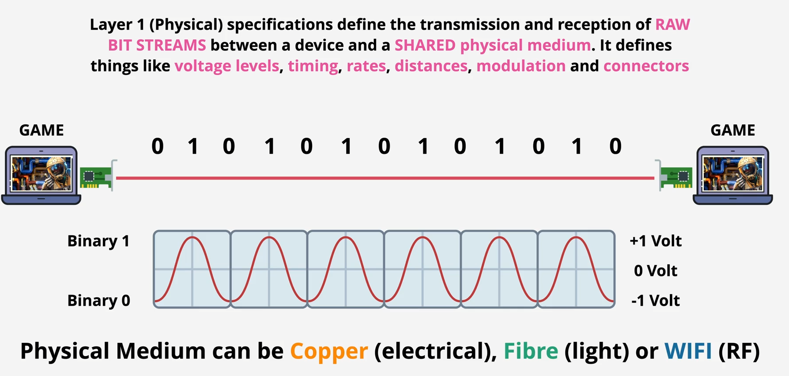
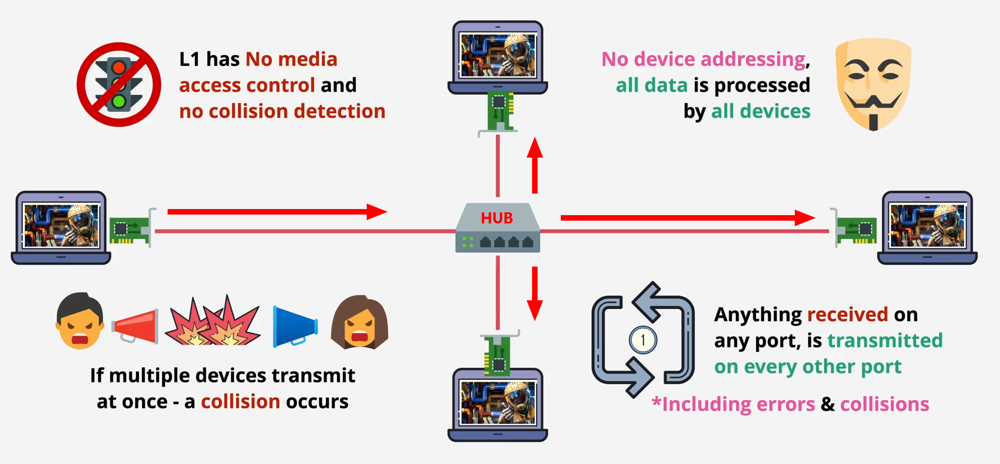
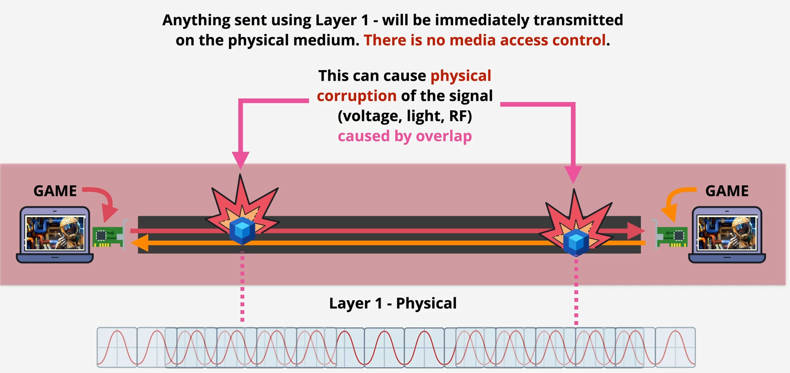

### Physical layer

- Specifications define the transmissino and reception of **`RAW BIT STREAM`** between a device and a **SHARED physical medium**
- It defines things like voltage levels, timing, rates, distance, modulation and connectors
- its function is transmitting signals need to use the **`same standards for transmitting and receiving in the same medium`**
- Coper(electric), Fibre(light), WIFI (RF)
- **`No access control`**
- **`No uniquely identified devices`**
- **`No device to device communications`**

### Device Connect Directly via Coper

### HUB

- layer 1 networking 1 devices can't address traffic at another labtop directly it broadcast medium (think like shout in room of 4 people without name)
- collision corupt the data and layer 1 don't have collision detection

### Collisoin Domain

