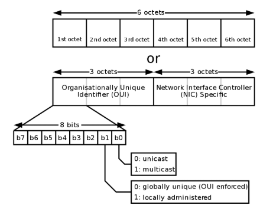
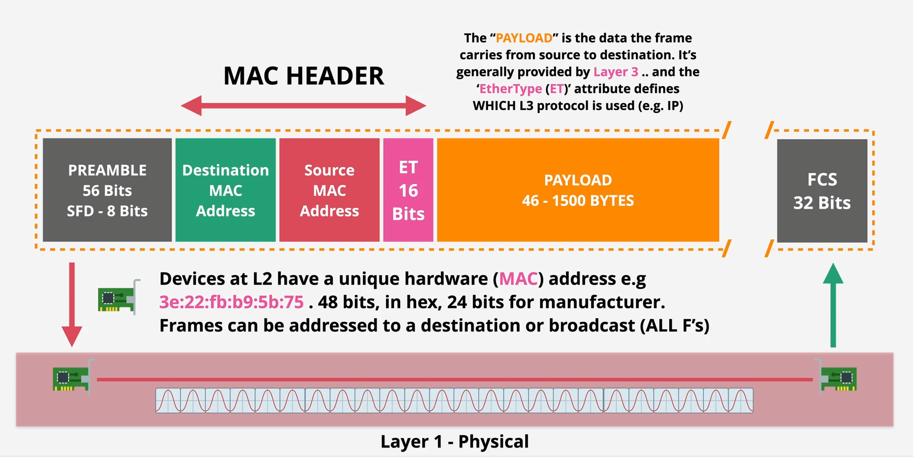
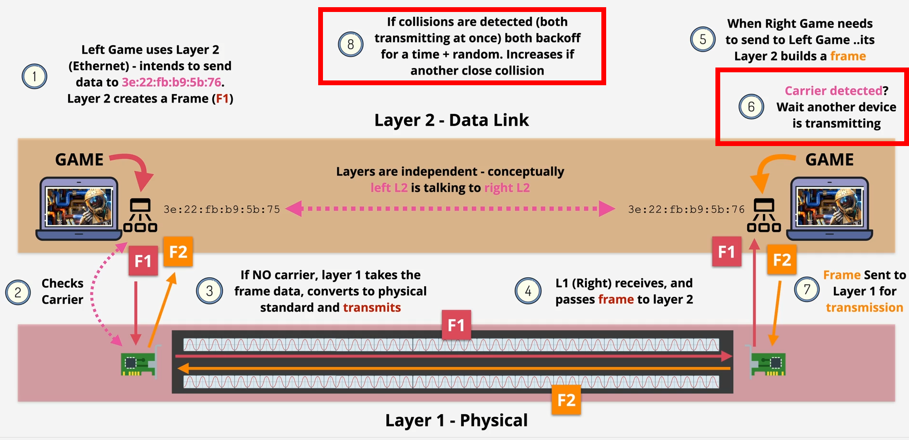
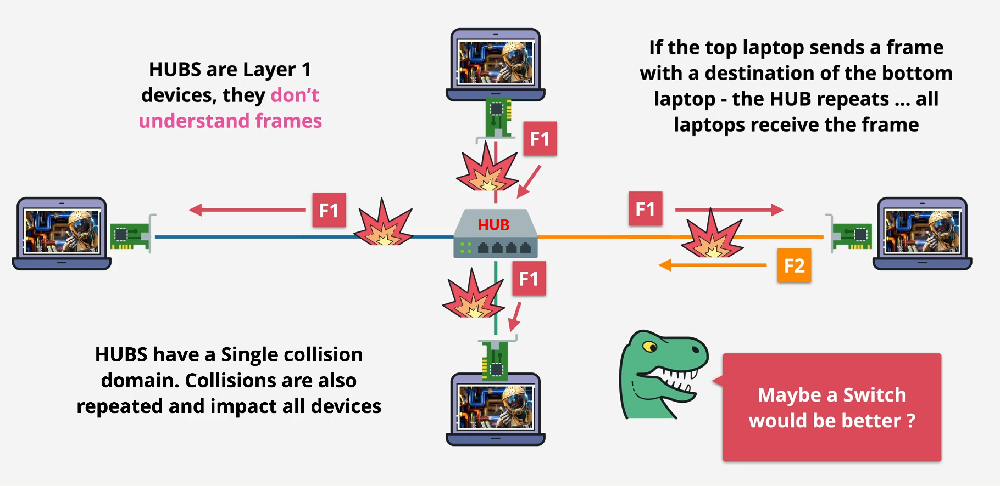
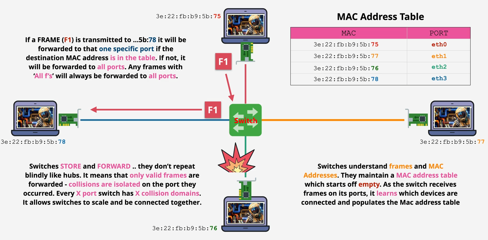

# Datalink Layer

- everything above this layer relies on the device to device communication that Datalink-layer provides
- run over layer 1 (physical layer)

# MAC 

- Media Access Control `Uniquely attached to physical not software`
- Unique hardware (MAC) address 48 bit, in hex, 24 bits for manufacturer
- Frame can be addressed to a destination or broadcast 

    
# Ethernet Frame

- most local networks use
- frame are a format for sending information over a layer 2 network

    

- Preamble allow the device to know that it's the start of the frame and sync clocks
- SFD (start frame delimeter) Last sync byte + "frame starts now"
- FCS frame check sequence alllows destination to check simple CRC check
### MAC HEADER

- Destination MAC can use `All F's to boardcast`
- Source MAC that sending this frame.
- Ether Type(ET) use to specify which layer 3 protocol is putting its data inside a frame ex IP.

# CSMA/CD

- Carrier Sense Multiple Access with Collision Detection
    

### Switch

- Hub are layer 1 devices and don't understand framds
    

- Switch is layer 2 device that have software of layer 2 running inside it so that understand layer 2 
  - can do Unicast communicatoins that is 1:1 communications
  - can do broadcast communications that is 1:all communications
   