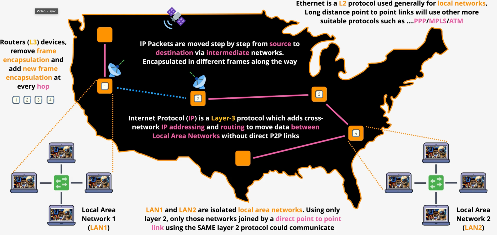
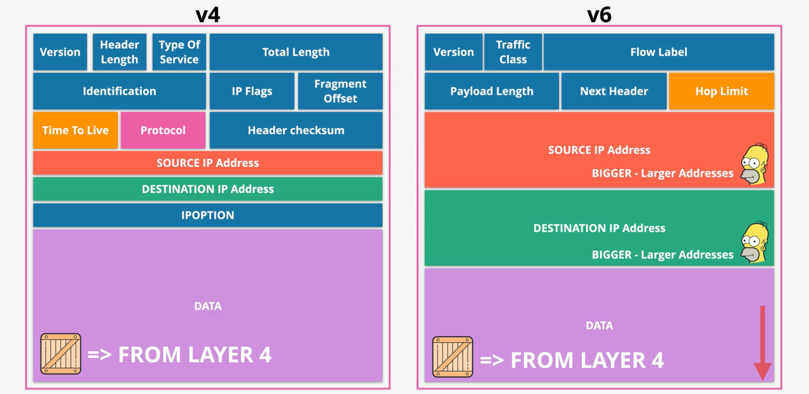
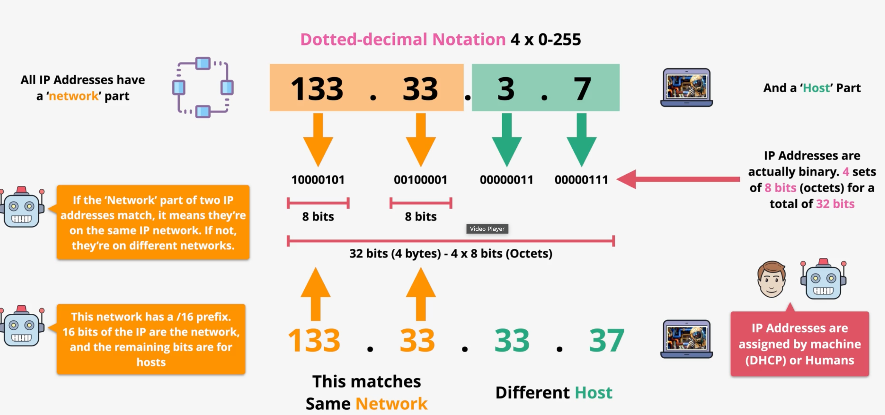
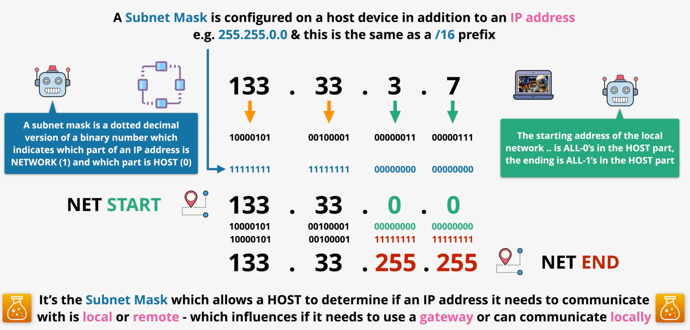
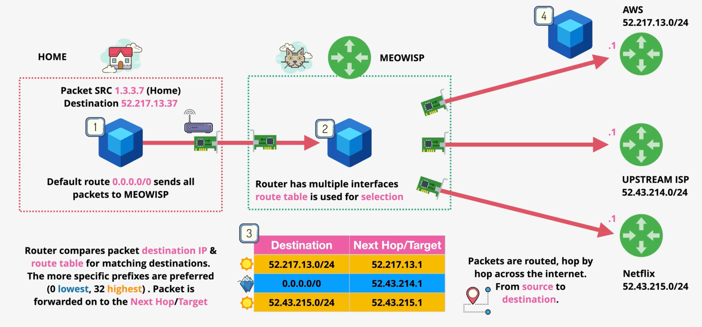

# Network layer

- Runs over datalink layer 
- **Why it exist** - job of this layer are to get data from local source to a local destinations
- different local area networks (LANs) need to use the same layer 2 protocol to communicate
- this layer 3 is inter-networking is common protocol that can span with different layer 2 protocol

# Packet structure

- The IP protocol which implementation on routers move packet between all of the network from source to destination and it's these fields use to perform that process, As packet move through each intermediate layer 2 network it will be encapsulated in a layer 2 frame
- A single packet can live inside many different frame throughout its route to its destination one for each layer 2 network which it move trough

    
    
- **Source IP address** is IP of machine that generate this packet
- **Destination IP address** is IP of machine that need to send packet to
- **Protocol** which protocol is use in layer 4 network because this packet contain layer 4 data
  - If layer 4 protocol use TCP data in this field will be 6
  - If layer 4 protocol use ICMP data in this field will be 1
  - If layer 4 protocol use UDP datat in this field will be 17
- **TTL** time to live is define maximum hops the packet can move through it's use to stop packet loop forever if they can't reach their destination before their discarded

# IP Structure

# Subnet Mask

- Subnet mask is configured on a host device in addition to an IP address
- It determine which section of IP is network which is host.
- this can help machine define to send data direcly on the same local network or when IP routhing needs to be used to transfer packets across different intermediate networks

# Router

- Layer 3 device that remove frame encapsulation and add new frame encapsulation at every hop
- In normal home is a default gateway when need to communicate with remote network

# Route table

- collection of routes 
- can be statically populated or there are protocols such as BGP or the border gateway protocol which allow routers to communicate to exchange which networks they know about
  
- This assume router on each node is .1