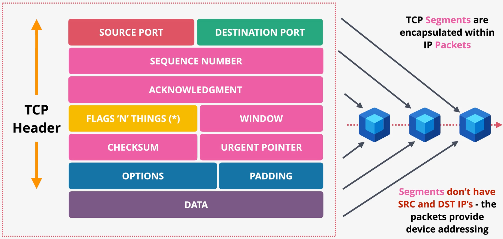
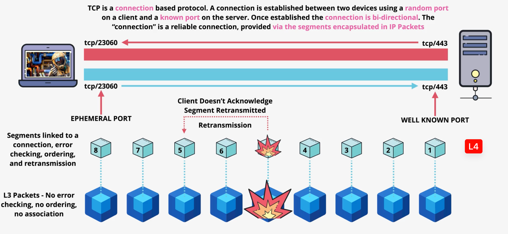
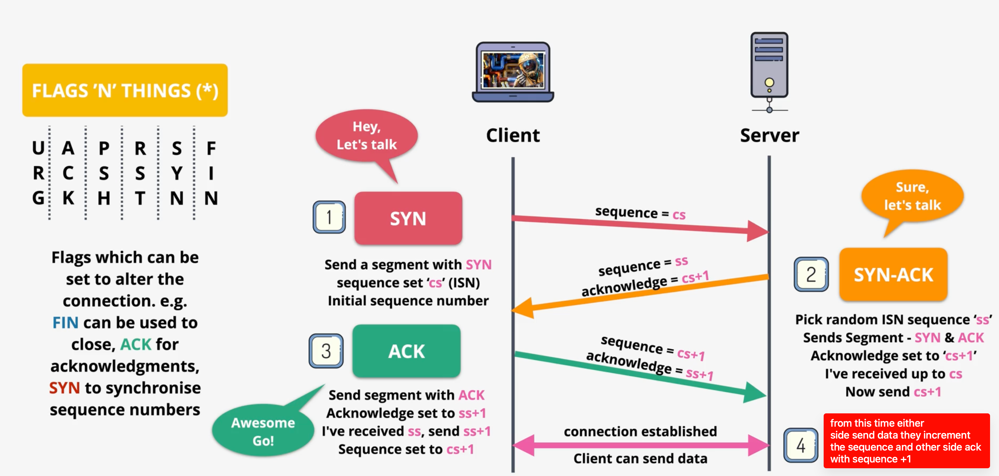
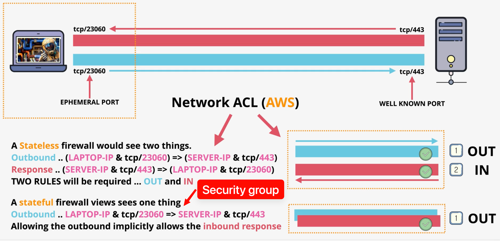

# Transport and application layer

# Layer 3 Problem

- each packet is routed independently
- No provides no ordering mechanism
- Not guaranteed to be reliable
- No separate the packets for individual application
- 

# layer 4 overview

# TCP segment 

## TCPHeader

### Source and destination port 

- add the ability to have multiple streams of conversations at the same time between two devices. 
- It combine source and destinatoin IP and source and destinatoin Port 
  to identifies a single comunication chanel

### Sequence number

- It incremented with each segment that's sent and it unique can use for error correction if need to be retransmitted
- It a way of uniquely identifying a particular segment in current connection

### Acknowledgment 

- One side can indicate that it's received
- every segment that be transmitted need to be acknowledged.

### Flags

- Use to control tcp connections.
  - close, sync, ack , fin, psh, urg
- It have some ofset field in this flag field (but too deep)

### Window

- The number of byte that you indicate that you're willing to receive between
  acknowledgement if reach the sender will pause until you acknowledge that 
  amount of data (use to control rate at which the sender sends data)

### Checksum

- able to detect error  

### Urgent pointer

- send out-of-band signal to the other side by passing the normalqueue ex. downloading a large file via FTP and press ctrl+c to abort it
- it let sender say " Pay attention to this part of the stearm immediately.
- use if sender set urg flag in flag field and urgent pointer value be points to the last byte of urgent data

# TCP 

- Bi-directional communication

# 3 - way handshake

- sequence number first it pick random for estabish connection after that it tracks which byte this segment start at.
- Acknowledgement will increase +1 it tell "I received up to byte x, send me x+1 next

# state-session

