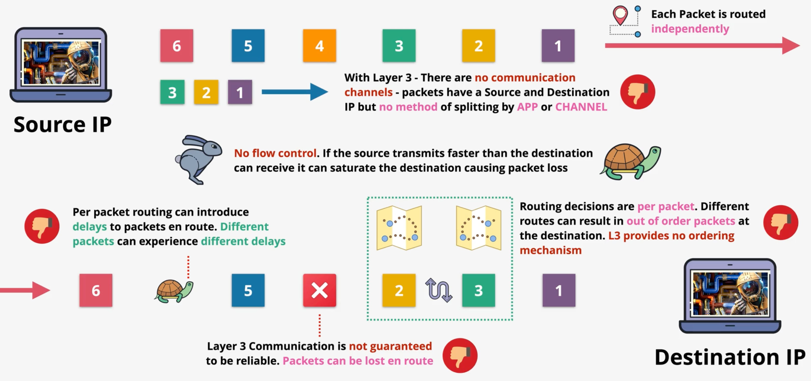
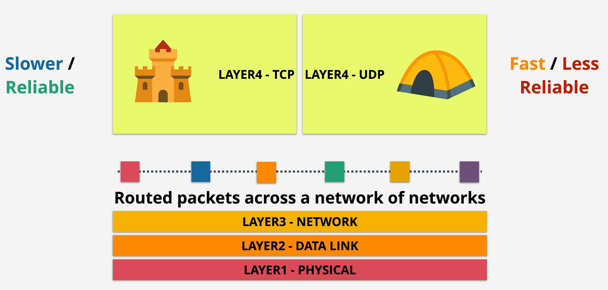

# Transport and application layer

# Layer 3 Problem

- each packet is routed independently
- No provides no ordering mechanism
- Not guaranteed to be reliable
- No separate the packets for individual application
- 

# layer 4 overview

# TCP segment 