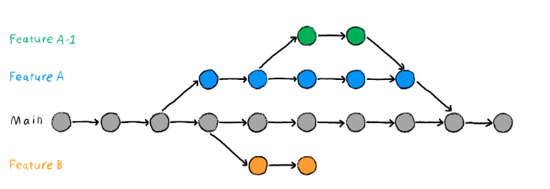
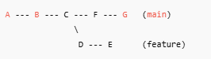

# Git Branch

- A branch is a movable pointer to a commit, representing an independent line of development
- Branches isolate work so you can experiment without breaking the main project
- Stable branches can be merged back; failed experiments can be discarded cleanly

# Architecture

- Each branch name points to the latest commit in that line
- Commits form a directed acyclic graph (DAG); branches are just labels on nodes



# Mental Model

```text
  1. Create branch   -->  new pointer at current commit
  2. Switch to it     -->  HEAD moves to new branch
  3. Make commits     -->  branch pointer advances, main stays
  4. Merge / delete   -->  integrate work or discard branch
```

Example: create and work on a feature branch

```bash
git switch -c feature-login        # create + switch
# ... edit files ...
git add -A && git commit -m "Add login form"
git switch main                    # back to main
git merge feature-login            # integrate
git branch -d feature-login        # clean up
```

# Core Building Blocks

### Branch Management

```bash
git branch                    # list all local branches
git branch <name>             # create branch at current commit
git branch -d <name>          # delete branch (safe — only if merged)
git branch -D <name>          # force-delete branch (even if unmerged)
git branch -vv                # list branches with tracking info
```

Related notes: [004-git-remote-repository](./004-git-remote-repository.md)
- A branch is just a pointer to a commit — creating one is instant and cheap
- `git branch -vv` shows tracking relationships at a glance

### Switching Branches

```bash
git switch <name>             # switch to existing branch
git switch -c <new_name>      # create new branch and switch to it
```

- `git switch` updates the working directory to match the target branch
- Uncommitted changes may block the switch if they conflict

Related notes: [004-git-remote-repository](./004-git-remote-repository.md)
- `git switch -c <name>` = create + switch in one command

### Merge

```bash
git merge <branch>            # merge <branch> into current branch
git merge --no-ff <branch>    # force a merge commit even if fast-forward is possible
```

- `--no-ff` benefits:
  - Always creates a merge commit — preserves branch history
  - Does not change existing commit hashes (unlike rebase)
  - Safe for shared/public branches

Related notes: [004-git-remote-repository](./004-git-remote-repository.md)
- `--no-ff` forces a merge commit to preserve branch topology

### Merge Types

**Fast-forward merge** — target branch has no new commits since the feature branch was created

- Git moves the branch pointer forward to the latest commit
- No merge commit is created

Situation


Merge Result


**Three-way merge** — both branches have new commits after diverging

- Creates a new merge commit with two parents
- Git compares three commits: common ancestor, HEAD of target branch, HEAD of merging branch
- May result in a merge conflict

Situation



Merge Result


Related notes: [004-git-remote-repository](./004-git-remote-repository.md)
- Fast-forward merge: no merge commit, pointer moves forward
- Three-way merge: new merge commit with two parents

### Merge Conflicts
- Happens when both branches edit the same part of a file and Git cannot auto-merge
- Must be resolved before the merge can complete
- Conflict markers: `<<<<<<<` (yours), `=======` (divider), `>>>>>>>` (theirs)
- `git merge --abort` cancels an in-progress merge
---

# Troubleshooting Guide

```text
  Merge failed?
    |
    +--> Conflict markers in file?
    |      YES --> edit file, remove markers, git add, git commit
    |      NO  --> check git status for untracked/staged issues
    |
    +--> Want to abort?
           YES --> git merge --abort
           NO  --> resolve all conflicts, then git commit
```
