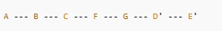

# Git Remote Repository

- Each developer has a full copy of the repository locally; sync happens via a Git server
- Remote-tracking branches (e.g., `origin/main`) are read-only local references to the remote state
- Core cycle: `fetch` downloads changes, `push` uploads changes, `pull` does both (fetch + merge)

# Architecture

```text
  +------------------+         +------------------+
  |  Remote Server   |         |  Local Machine   |
  |  (origin)        |         |                  |
  |  main --------+  |  fetch  |  origin/main     |
  |  featureA     |  | ------> |  origin/featureA |
  |               |  |         |                  |
  |               |  |  push   |  main            |
  |               |  | <------ |  featureA        |
  +------------------+         +------------------+
```

- Remote branches (`origin/*`) are updated only by `git fetch` or `git pull`
- You cannot commit directly to remote-tracking branches

# Mental Model

```text
  1. git clone <url>       -->  full copy + origin configured + tracking set
  2. git fetch             -->  update origin/* pointers (working dir unchanged)
  3. git pull              -->  fetch + merge into current branch
  4. git push              -->  upload local commits to remote
  5. git rebase <branch>   -->  replay commits on top (linear history)
```

Example: typical pull-rebase-push workflow

```bash
git switch main
git pull                           # fetch + merge latest
git switch feature-auth
git rebase main                    # replay feature commits on updated main
git push --force-with-lease        # push rebased history safely
```

# Core Building Blocks

### Clone

```bash
git clone <repo-url>
```

- Downloads the full repository and creates a folder with the repo name
- Automatically creates the `.git` directory
- Sets `origin` as the default remote name
- Sets up the default tracking branch (e.g., local `main` tracks `origin/main`)
- Ready to push and pull immediately

Related notes: [003-git-branch](./003-git-branch.md)

### Remote Management

```bash
git remote                                          # list configured remotes
git remote -v                                       # show fetch and push URLs
git remote update                                   # fetch updates from all remotes
git remote add <name> <url>                         # add a new remote
git remote remove <name>                            # remove a remote
git remote rename <old> <new>                       # rename a remote
```

**Change remote URL:**

```bash
git remote set-url <remote> <new_url>               # change fetch URL
```

**Multiple push URLs (push to multiple repositories):**

```bash
git remote set-url --add --push <remote> <url>      # add a push URL
git remote set-url --delete --push <remote> <url>   # remove a push URL
```

Related notes: [005-git-pull-request](./005-git-pull-request.md)

### Tracking (Upstream) Branches

```bash
git branch -u <remote>/<branch>
```

- Sets the upstream (tracking) branch for the current local branch
- Defines where `git pull` and `git push` operate by default

Related notes: [003-git-branch](./003-git-branch.md)

### Fetch, Push, Pull

```bash
git fetch [remote]                # update remote-tracking branches (default: origin)
                                  # does NOT modify working directory or local branches

git push                          # upload local commits to upstream branch

git pull                          # fetch + merge from upstream into current branch
```

`git pull` is equivalent to:

```bash
git fetch <remote>
git merge <upstream-branch>
```

Related notes: [003-git-branch](./003-git-branch.md)

### Git Rebase

```bash
git rebase <branch>               # replay current branch commits on top of <branch>
git rebase                        # rebase onto tracking branch
```

- Changes the base commit of a branch
- Avoids merge commits by rewriting history into a linear sequence
- **Do NOT rebase public/shared branches that have already been pushed**

**Steps to rebase (before pushing):**

1. `git switch main` — switch to main
2. `git pull` — get latest changes
3. `git switch <feature>` — switch to feature branch
4. `git rebase main` — replay feature commits on top of main
5. `git push` — push the result

Scenario


Result



**Rebase conflict handling:**

- Open file, remove conflict markers, keep correct logic
- After fixing: `git add <file>` then `git rebase --continue`

Related notes: [003-git-branch](./003-git-branch.md), [005-git-pull-request](./005-git-pull-request.md)

### Cleaning After Merge

```bash
git push --delete <remote> <branch>    # delete remote branch
git branch -d <branch>                 # delete local branch
```

Related notes: [003-git-branch](./003-git-branch.md)

---

# Troubleshooting Guide

```text
  Push rejected?
    |
    +--> "non-fast-forward" error?
    |      YES --> git pull --rebase, resolve conflicts, git push
    |
    +--> No upstream set?
    |      YES --> git push -u origin <branch>
    |
    +--> Rebase conflict?
           fix file --> git add --> git rebase --continue
           want to abort? --> git rebase --abort
```

# Quick Facts (Revision)

- `git clone` gives you a full repo copy with `origin` remote pre-configured
- Remote-tracking branches (`origin/*`) are read-only locally
- `git fetch` updates remote pointers without touching your working directory
- `git pull` = `git fetch` + `git merge`
- `git push` uploads local commits to the configured upstream
- `git rebase` replays commits for linear history — never rebase shared branches
- `git branch -u` sets the upstream tracking branch
- Use `git remote set-url --add --push` to push to multiple repositories at once
