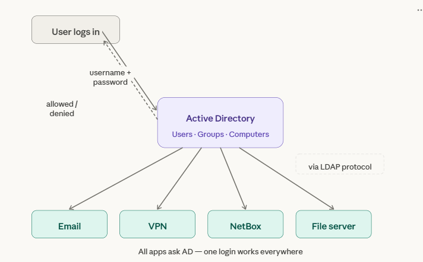
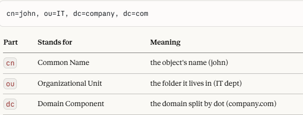
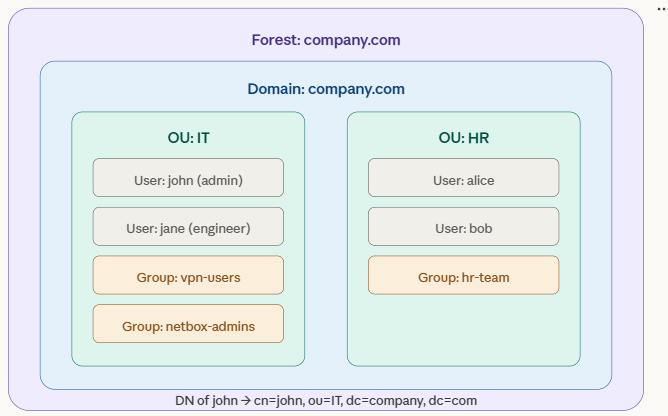
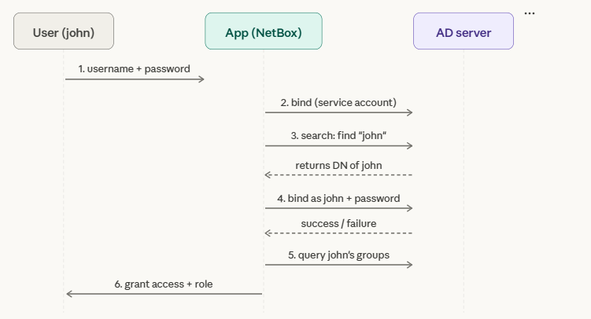

# AD-LDAP

# Overview

- **Why it exists** — solve chaos users/password
- **What it is** — one central directory that stores all users, passwords, and groups. Every app asks that directory
- **One-liner** — centralize user/passwd store, AD holds all users and groups. LDAP is how apps query AD

# Architecture

# Core Building Blocks

### DN (Distinguished Name)

-  it's the full unique address of any object in the LDAP directory tree.
Like a file path, but for identity objects:

### AD (Active Directory)

- AD stores everything in a tree structure — like a file system, but for identity objects.

| Object                                                       | What it is                                                    |
| ------------------------------------------------------------ | ------------------------------------------------------------- |
| Forest                                                       | The entire AD universe for a company                          |
| Domain                                                       | A partition inside the forest, e.g. company.com               |
| OU (Org Unit)|A folder — groups users/computers by department |
| User                                                         | A person account with attributes (name, email, password hash) |
| Group                                                        | A collection of users — used for permissions                  |
| Computer                                                     | A machine joined to the domain                                |

### LDAP (Lightweight Directory Access Protocol)

- standardized way to query a directory
- When any app (NetBox, Grafana, VPN) wants to authenticate a user via AD, it follows these steps:
  1. Connect — App opens a TCP connection to the AD server on port 389 (or 636 for encrypted LDAPS)
  2.  Bind — App "logs in" to AD using a service account (a dedicated read-only user) so it has permission to search the directory
  3.  Search — App sends a query: "Find the user with username = john"
  4. Verify password — App tries to bind again as `john` with the password he typed — if AD accepts it, the password is correct
  5. Check group — App queries which groups john belongs to, then decides what permissions to give him
  
