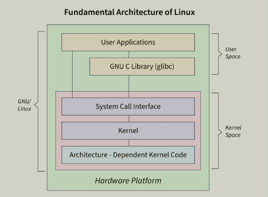

# Linux Core Overview

- Linux is a Unix-like operating system centered around the Linux kernel.
- The kernel is the core layer that controls CPU, memory, devices, filesystem, networking, and process isolation.
- User space tools (shell, systemd, package managers, utilities) interact with the kernel via system calls.


# Linux System Architecture



```text
User Applications (bash, nginx, python, vim)
                    ↓
Shell / Service Manager (bash, systemd)
                    ↓
System Libraries (glibc)
                    ↓
System Calls (open, read, write, fork, execve)
                    ↓
Linux Kernel
                    ↓
Hardware (CPU, RAM, Disk, NIC)
```

- User space cannot directly touch hardware; it requests the kernel to do it.
- This separation provides stability, isolation, and security.

# User Space vs Kernel Space

- **User space**: where normal applications run with limited privileges.
- **Kernel space**: where kernel code runs with full hardware/system access.
- Applications switch to kernel space via system calls (`open`, `read`, `write`, `fork`, `execve`).
- This isolation prevents one app from directly corrupting the whole system.

# Kernel Responsibilities

- Process scheduling (which process runs, and when).
- Memory management (virtual memory, paging, cache).
- Filesystem management (inodes, mounts, permissions).
- Device drivers (disk, NIC, keyboard, GPU).
- Networking stack (TCP/IP, routing, sockets, firewall hooks).
- Security model (users, groups, capabilities, namespaces, cgroups).

# Linux Mental Model

```text
User runs command
    ↓
Shell parses command
    ↓
Program calls system calls
    ↓
Kernel performs operation
    ↓
Result returns to stdout/stderr or file/network/device
```

Example:

```bash
cat /etc/hostname
```

- Shell starts `cat` process.
- `cat` calls `open()` + `read()`.
- Kernel reads bytes from filesystem cache/disk.
- `cat` writes output to stdout.


# Core Building Blocks

### Filesystem and Storage

- Linux treats many resources as files (`/dev`, `/proc`, `/sys`).
- Data lives on mounted filesystems under one root tree `/`.
- Important paths:
  - `/etc` config files
  - `/var` variable data (logs, spool, cache)
  - `/home` user data
  - `/proc` process and kernel runtime info
  - `/dev` device files

Related notes:
- [05-file-system-mount](./05-file-system-mount.md)
- [06-disk](./06-disk.md)

### Process Model

- Every running program is a process with a PID.
- Parent/child relation is created by `fork()` and `execve()`.
- Foreground/background jobs are shell-level control.
- `systemd` is usually PID 1 and manages system services.

Related notes:
- [07-process-stat](./07-process-stat.md)
- [09-service-systemctl-socket](./09-service-systemctl-socket.md)

### Users, Groups, and Permissions

- Access control starts with UID, GID, and mode bits (`rwx`).
- Standard classes: owner, group, others.
- Elevated operations use `sudo` (or root).

Related notes:
- [03-user-group-permission](./03-user-group-permission.md)

### Networking Fundamentals

- Applications communicate through sockets.
- Kernel networking chooses routes and interfaces.
- Name resolution flow depends on `/etc/nsswitch.conf` and DNS resolver setup.

Related notes:
- [Networking/000-core](./Networking/000-core.md)
- [Networking/005-dns-resolution-linux](./Networking/005-dns-resolution-linux.md)

### Software and Package Management

- Software is typically installed via distro package manager.
- Package sources, signatures, and dependencies matter for reliability.

Related notes:
- [04-software-distributed](./04-software-distributed.md)

### Observability and Logs

- System behavior is inspected from process stats, logs, and service states.
- Core tools: `ps`, `top`, `journalctl`, `dmesg`, `ss`, `df`, `free`.

Related notes:
- [08-log](./08-log.md)

---

# Practical Command Set (Core)

```bash
# system
uname -a
uptime

# cpu/memory/process
ps aux
top
free -h

# filesystem/disk
lsblk
df -h
mount
/etc/fstab

# networking
ip a
ip r
ss -tulpen

# services/logs
systemctl status <service>
journalctl -u <service> -n 100 --no-pager
```

- These commands cover most first-pass Linux troubleshooting.

# Troubleshooting Flow (Quick)

```text
Symptom appears
    ↓
Check service state (systemctl)
    ↓
Check logs (journalctl / log files)
    ↓
Check process/resources (ps, top, free, df)
    ↓
Check network/listening ports (ip, ss, route, dns)
    ↓
Apply fix and verify
```

# Quick Facts (Revision)

- PID 1 is usually `systemd`.
- Exit code `0` means success; non-zero means failure.
- Use `SIGTERM` first, `SIGKILL` only when needed.
- After editing `/etc/fstab`, run `mount -a` before reboot.

# Topic Map

- [01-Basic-file-and-text-manipulation](./01-Basic-file-and-text-manipulation.md)
- [02-Advance-text-manipulation copy](./02-Advance-text-manipulation%20copy.md)
- [03-user-group-permission](./03-user-group-permission.md)
- [04-software-distributed](./04-software-distributed.md)
- [05-file-system-mount](./05-file-system-mount.md)
- [06-disk](./06-disk.md)
- [07-process-stat](./07-process-stat.md)
- [08-log](./08-log.md)
- [09-service-systemctl-socket](./09-service-systemctl-socket.md)
- [10-shell-environment-and-path.md](./10-shell-environment-and-path.md)
- [Networking Core](./Networking/000-core.md)
