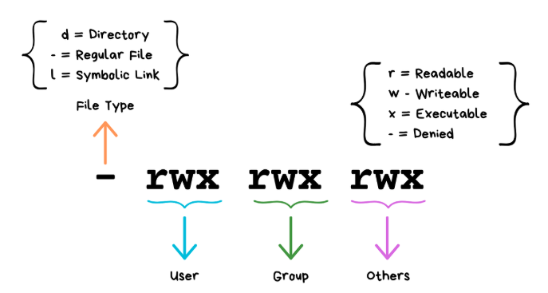

# User

```bash
whoami
useradd <user_name>
userdel <user_name>
passwd
su <user_name>
```

- `whoami` show current user.
- `useradd -m <user_name>` create user and home directory.
- `useradd -s /bin/bash <user_name>` create user and set login shell.
  - `-s /bin/false` Disable Login
- `useradd -r <user_name>` create user for system account NO human login.
- `useradd -U <user_name>` create Group With Same Name.
- `useradd -d <directory> <user_name>` Sets home directory location..
- `userdel -r <user_name>` remove user and home directory.
- `passwd` change password.
- `passwd -e <user_name>` password expire force a user to change their 
  password upon next login.
- `passwd -S <user_name>` show password status
  - `L` Locked
  - `P` Password set (usable)
  - `NP` No password
- `su <user_name>` change to specific user.
  
### See create-user.sh to see more flow 
[create-user.sh](../Shell-script/User/create_user.sh)


# Group

```bash
groups
getent group
groupadd <group_name>
groupdel <group_name>
```

- `groups` Show group of current user.
- `getent group` show all groups and group information in fromat <br>
  `group_name:password:GID:user1,user2,user3`

### Primary Group

- Every Linux user has:
    - 1 Primary Group use when create file ownership become primary group.
    - 0 or more Supplementary Groups


# User Mod and Group Mod

```bash
usermod [option] <user_name>
groupmod [option] <group_name>
```

- `usermod -aG <group_name> <user_name>` Add user to a supplementary group.
  Must use `-a` (append) with `-G` (supplementary group.) or it will overwrite existing groups.
- `usermod -g <group_name> <user_name>` Change primary group. User can have only 
  ONE primary group.
- `usermod -l <new_name> <old_name>` Change username.
- `usermod -d /new/home <user_name>` Change home directory path.
- `usermod -d /new/home -m <user_name>` Change home directory and move
  existing files to new location.
- `usermod -s /bin/bash <user_name>` Change login shell.
- `usermod -L <user_name>` Lock user account (disable password login).
- `usermod -U <user_name>` Unlock user account.
- `groupmod -n <new_name> <old_name>` Change group name.
- `groupmod -g <GID> <group_name>` Change group ID (GID).

### See change-username.sh to see more flow 

[change-username.sh](../Shell-script/User/change-username.sh)


# Permission

```bash
chmod <mode> <file>
chown <new_own>:<new_group> <file>
chmod u+x file
chmod g-w file
chmod o+r file
```

- See permission use `ls -l`
- Mode in permission
  - Read (4)
  - Write (2)
  - Execute (1)
  - No permission (0)
  - Example: 755 → rwx r-x r-x



- See more file type in [01-basic-file-and-text-manipulation.md](01-Basic-file-and-text-manipulation.md)
  
- `chmod -R <mode> <dir>` apply to directory and all contents.
- `chown` change file owner and/or group.
- `chown -R` apply recursively.
- Only root can change file owner.

### Note

- Without x on directory, you cannot cd into it.

# umask

```bash
umask
umask 022
umask 027
```

- `umask` defines default permission mask for new files/directories.
- Typical defaults:
  - `022` -> files `644`, directories `755`
  - `027` -> files `640`, directories `750`

# Special Permissions

```bash
chmod 4755 <file>   # setuid
chmod 2755 <dir>    # setgid
chmod 1777 <dir>    # sticky bit
```

- `setuid (4)` on executable: run with file owner's UID.
- `setgid (2)` on directory: new files inherit directory group.
- `sticky bit (1)` on directory: only owner/root can delete own files.
  - Example: `/tmp` usually `1777`.

# ACL (Access Control List)

```bash
getfacl <path>
setfacl -m u:alice:rwx <path>
setfacl -m g:dev:r-x <path>
setfacl -x u:alice <path>
```

- ACL provides finer permissions beyond owner/group/others.
- Useful when multiple users need different access on same directory.
