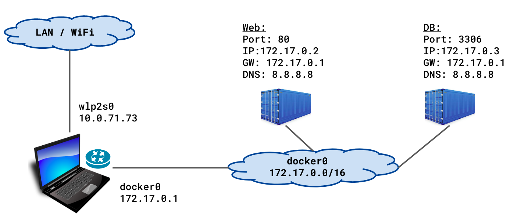
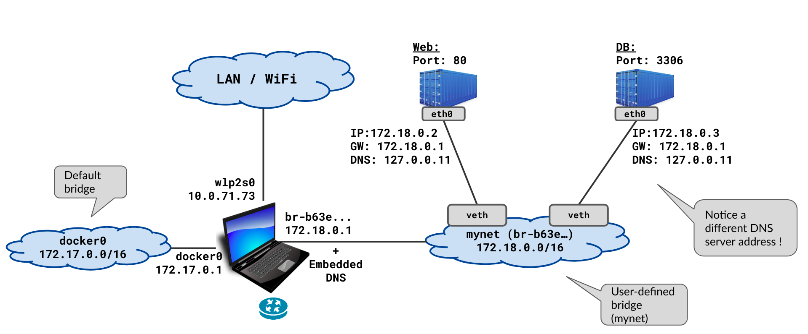
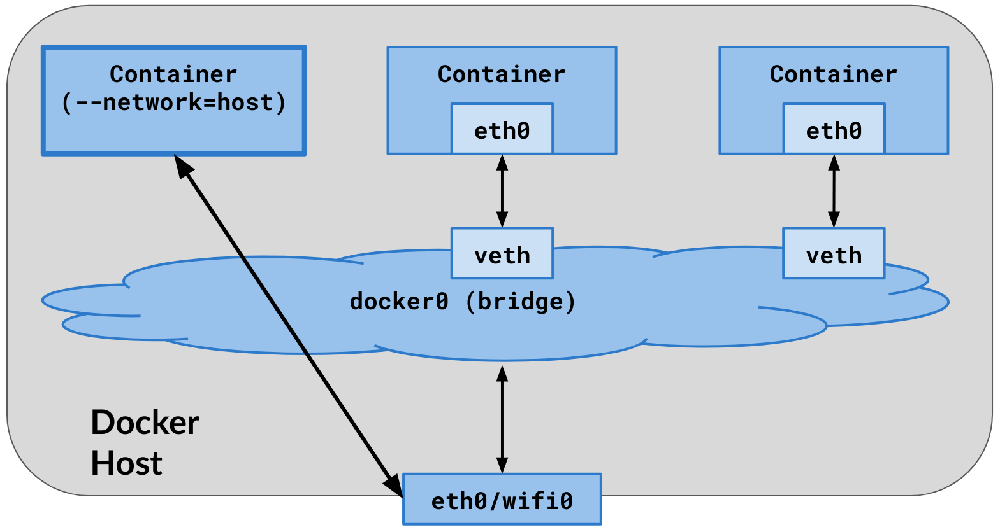
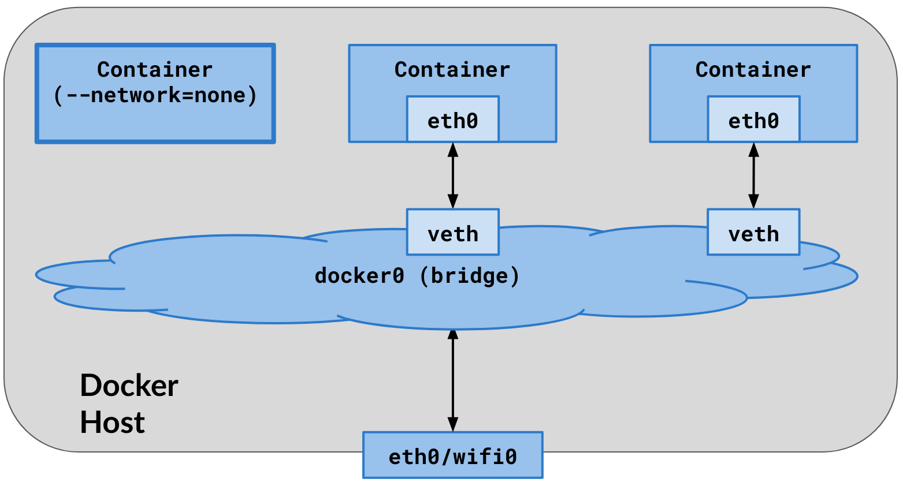

# Docker Networking

- Each container has its own network namespace; can attach to one or more networks.
- **bridge** (default): Private network on host; containers get IPs; port mapping to reach from host.
- **host**: Container shares host network; no isolation.
- **none**: No network.
- **user-defined**: Create with `docker network create`; attach containers; DNS by container name.

### Network Modes

**Default bridge network** — containers get IPs on docker0 bridge, communicate via IP (no DNS):



**User-defined bridge** — containers resolve each other by name (built-in DNS):



**Host network** — container shares host's network stack directly:



**None network** — completely isolated, no network:



```text
Bridge (default)                          Host
┌──────────────────────────┐     ┌──────────────────────┐
│ Host                     │     │ Host                 │
│  docker0 (bridge)        │     │                      │
│   ┌─────┐  ┌─────┐      │     │  ┌─────┐             │
│   │ctr A│  │ctr B│      │     │  │ctr A│ shares      │
│   │veth │  │veth │      │     │  │host │ host net    │
│   └──┬──┘  └──┬──┘      │     │  └─────┘             │
│      └────┬────┘         │     │  port 80 = host:80   │
│      iptables/NAT        │     └──────────────────────┘
│      -p 8080:80          │
└──────────────────────────┘     None
                                 ┌──────────────────────┐
User-defined                     │  ┌─────┐             │
┌──────────────────────────┐     │  │ctr A│ no network  │
│  mynet (bridge)          │     │  └─────┘             │
│   ┌─────┐  ┌─────┐      │     └──────────────────────┘
│   │web  │  │app  │      │
│   │     │──│DNS  │      │
│   └─────┘  └─────┘      │
│  containers resolve      │
│  each other by name      │
└──────────────────────────┘
```

```bash
docker network create mynet
docker run -d --network mynet --name web nginx
docker run -d --network mynet --name app myapp
# app can resolve "web"
```

# Port Mapping

- `-p 8080:80` — host port 8080 → container port 80.
- `-P` — publish all EXPOSE'd ports to random host ports.
- Without publish, container is only reachable from same network (other containers).

# Volume

- Persist data outside container lifecycle; survive container remove.
- **Named volume**: Managed by Docker; `docker volume create` or declare in compose; good for DB data.
- **Bind mount**: Host path mounted in container; `-v /host/path:/container/path`; good for config or dev source.
- **tmpfs**: In-memory; `--tmpfs /tmp`; no disk.

```bash
docker run -v mydata:/var/lib/app myimg
docker run -v $(pwd)/config:/app/config:ro myimg
```

# Volume Drivers

- Default local driver stores data in Docker area (e.g. `/var/lib/docker/volumes/`).
- Other drivers: NFS, cloud (e.g. AWS EBS), plugins; specify in `docker volume create --driver`.

# Read-Only and Permissions

- Bind mount: `:ro` for read-only in container.
- File ownership in container follows container user; host path permissions apply on host.

### Volume Types

```text
Named Volume                    Bind Mount                 tmpfs
┌────────────┐              ┌────────────┐           ┌────────────┐
│ Container  │              │ Container  │           │ Container  │
│ /var/data  │              │ /app/src   │           │ /tmp       │
└─────┬──────┘              └─────┬──────┘           └─────┬──────┘
      │                           │                        │
      ▼                           ▼                        ▼
Docker managed              Host filesystem            RAM (memory)
/var/lib/docker/            /home/user/src             no disk write
volumes/mydata/                                        lost on stop
```

Related notes: [007-docker-run-advanced](./007-docker-run-advanced.md)

---

# Troubleshooting Guide

### Container cannot reach another container by name
1. Both must be on the **same user-defined network**: `docker network inspect <net>`.
2. Default bridge does NOT have DNS — use `docker network create mynet`.
3. Check container is running: `docker ps`.

### "bind: address already in use" on port mapping
1. Another process uses the port: `ss -tlnp | grep <port>`.
2. Another container uses it: `docker ps | grep <port>`.
3. Use a different host port: `-p 8081:80`.

### Volume data not persisting after container remove
1. Check if using `--rm` — container and anonymous volumes are removed.
2. Use **named volumes**: `docker run -v mydata:/data` (not `-v /data` which is anonymous).
3. Verify volume exists: `docker volume ls`.

### Permission denied accessing bind mount
1. Check host directory permissions: `ls -la /host/path`.
2. Container user UID must match host file ownership or have read access.
3. Use `--user $(id -u):$(id -g)` or fix permissions on host.
