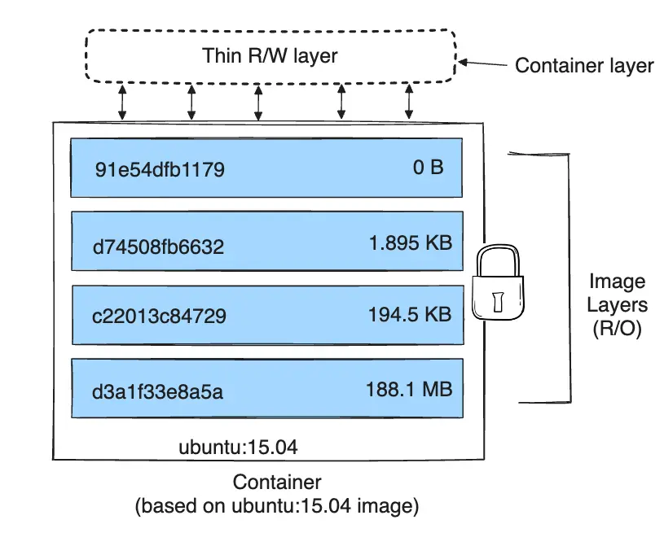
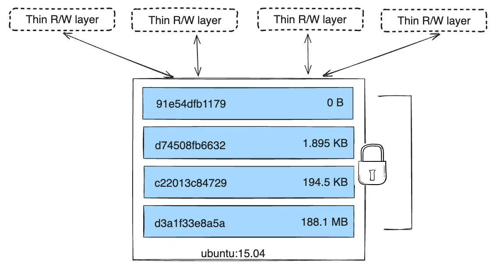

# How Layers Work

- Each Dockerfile instruction (except a few like ENV that can be merged) creates a **read-only layer**.
- Layers are stacked; top layer is the final filesystem view.
- When you run a container, Docker adds a **writable layer** on top of the image layers; all writes go there (copy-on-write).
- **Layer = diff** from previous layer; stored by content hash; same layer can be shared across images.



### Multiple Containers Sharing Layers

Multiple containers from the same image share all read-only layers; each gets its own thin writable layer.



# Why Order Matters

- Docker rebuilds from the first changed instruction; all layers after that are recreated.
- Put rarely changing steps first (e.g. base image, install system deps), frequently changing steps last (e.g. COPY app code).
- Example: If you COPY . . before RUN npm install, any file change invalidates cache for RUN and everything after; better: COPY package*.json first, RUN npm ci, then COPY . . so only code changes invalidate last steps.

# Build Cache

- **Cache hit**: Instruction and all previous layers unchanged → reuse cached layer.
- **Cache miss**: Instruction or input changed → rebuild that layer and all following.
- **--no-cache**: Ignore cache; rebuild all layers (docker build --no-cache).
- **Cache from**: Use another image as cache source (e.g. previous build); advanced use for CI.

# Build Context

- **Context** = set of files sent to Docker daemon for COPY/ADD (usually current directory: `.`).
- Everything under the context path is sent (unless .dockerignore excludes it); large context = slow build.
- **.dockerignore**: Like .gitignore; exclude files/dirs from context; reduces size and avoids copying secrets or build artifacts.
- Never COPY secrets; use build-time secrets (--secret) or runtime env/volumes.

```text
# .dockerignore
.git
node_modules
*.log
.env
dist
```

# Multi-Stage Build — Why and How

- **Problem**: Building compilers and deps increases image size and attack surface.
- **Solution**: First stage (builder) compiles/builds; second stage copies only artifacts (binary, static files) into minimal base.
- Only the last stage's layers become the final image; earlier stages are discarded.
- **COPY --from=stage_name**: Copy from earlier stage or from any image.

```dockerfile
# Stage 1: build
FROM node:20-alpine AS builder
WORKDIR /app
COPY package*.json ./
RUN npm ci
COPY . .
RUN npm run build

# Stage 2: run
FROM nginx:alpine
COPY --from=builder /app/dist /usr/share/nginx/html
EXPOSE 80
CMD ["nginx", "-g", "daemon off;"]
```

# Reducing Image Size

- Use **alpine** or **distroless** base when possible.
- **Multi-stage**: Don't ship build tools in final image.
- **Combine RUN** and clean in same layer: `RUN apt update && apt install -y pkg && rm -rf /var/lib/apt/lists/*` so cache doesn't keep deleted files.
- Avoid **ADD** for local archives (use COPY + RUN to extract) so you control what goes in.
- **Squash** (experimental or buildkit): Merge layers into one; reduces layers but can reduce cache reuse.

# BuildKit

- Modern build engine (enable with DOCKER_BUILDKIT=1 or in daemon config).
- Parallel stage builds, better cache, **RUN --mount=type=cache** for persistent cache across builds.
- **--mount=type=secret**: Mount secret at build time without leaving it in image.

Related notes: [003-dockerfile](./003-dockerfile.md), [006-registry-tagging-push-pull](./006-registry-tagging-push-pull.md)

---

# Troubleshooting Guide

### Build is slow / not using cache
1. Check instruction order: put `COPY package*.json` + `RUN npm ci` before `COPY . .`.
2. Check if `.dockerignore` excludes unnecessary files (node_modules, .git, logs).
3. Enable BuildKit: `DOCKER_BUILDKIT=1 docker build .` — parallel builds and better cache.

### Image unexpectedly large
1. Check layer sizes: `docker history <image>`.
2. Look for large RUN layers that install + don't clean: combine `apt install && rm -rf /var/lib/apt/lists/*`.
3. Use multi-stage build to exclude build tools from final image.
4. Check if `.dockerignore` is missing — entire build context (including .git) may be copied.

### "layer does not exist" or "manifest unknown"
1. Image may have been deleted from registry or local cache.
2. Try `docker pull <image>` again.
3. If using digest, verify it still exists in registry.
