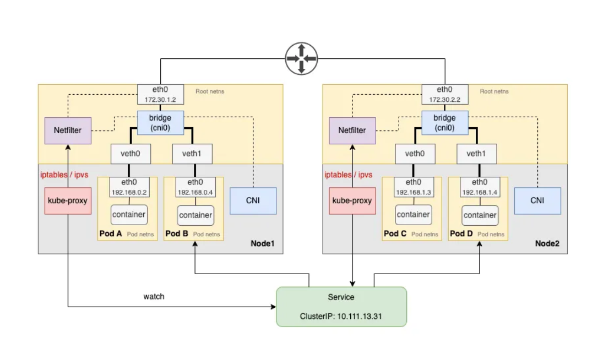

# kubelet and kube-proxy

# Overview

### kubelet
- **Why it exists** — worker nodes need an agent to run and manage pods locally.
- **What it is** — kubelet watches the API server for pod assign to it node ,then send it to container runtime to load and unload container and send back report status of pod on them
- **One-liner** — contact point with kubeapi on workernode and monitored pod in node, kubelet manages the full pod lifecycle (start, stop, health checks, resource reporting)

### kubeproxy
- **Why it exists** — to make services reachable across all nodes
- **What it is** — Kube proxy is a process that runs on each node in the Kubernetes cluster. Its job is to look for new services and EndpointSlices. And every time a new service is created, it creates the appropriate rules on each node to forward traffic to those services to the backend pods. One way it does this is using iptables rules.
- **One-liner** — kube-proxy just ensures any node can reach service use iptables to route through it

# Architecture

# Core Building Blocks

### kubelet

1. Scheduler assigns a node → writes nodeName to pod spec via API server                                                                                                                                   
2. Kubelet watches the API server for pods assigned to its node                                                                                                                                          
3. Kubelet then instructs the container runtime(CRI)  
4. kubelet continue monitor status of pod and container and report to apiserver

### kube-proxy

- service it self can't get an real network interface it only have clusterIP because as it a virtual component that only lives in iptables/ipvs rules(virtual)
- but service should be accessible across the cluster from any nodes
- kube proxy can achieved that by it self as a process run on every node in cluster and look for new service and create the appropriate rules on each node to forward traffic to those services to the backend pods

### Container Runtime Interface (CRI)
