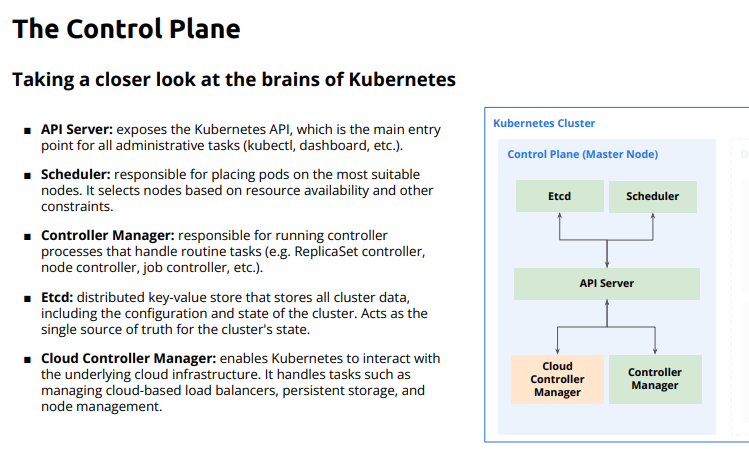
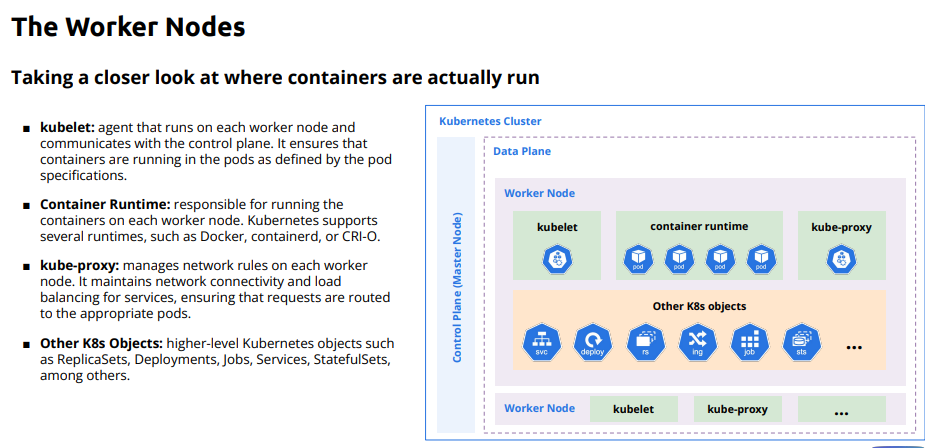

# Cluster Architecture

# Overview
- **Why it exists** — running containers at scale 
- **What it is** — Kubernetes is a container orchestration platform with a control plane that makes decisions and worker nodes that run workloads. You declare desired state in YAML; Kubernetes continuously reconciles actual state to match.
- **One-liner** — Kubernetes is a declarative system where you describe what you want and controllers make it happen across a cluster of nodes.

# Architecture

