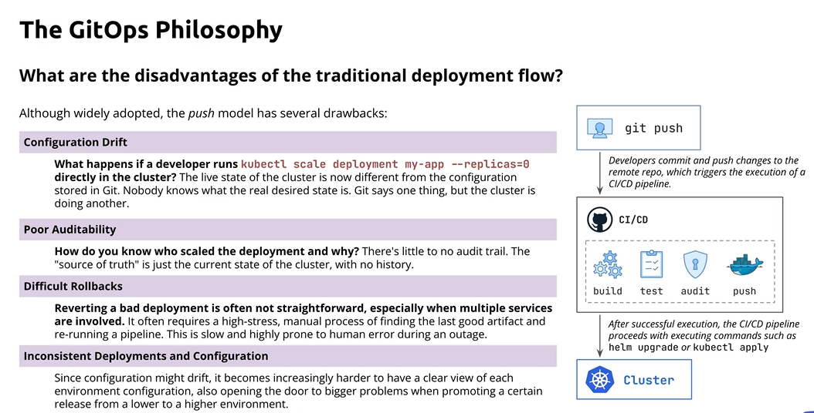
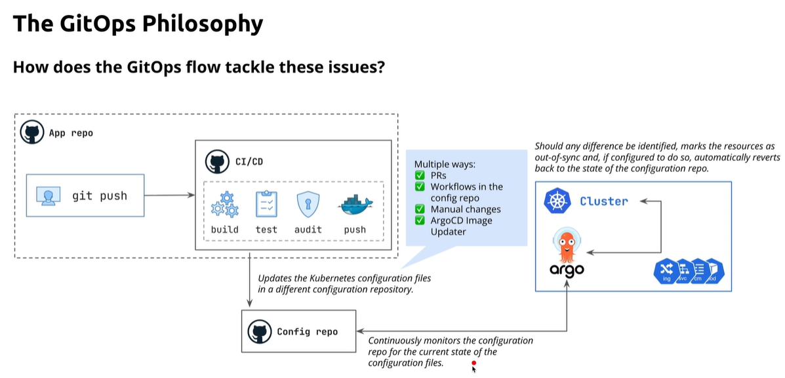
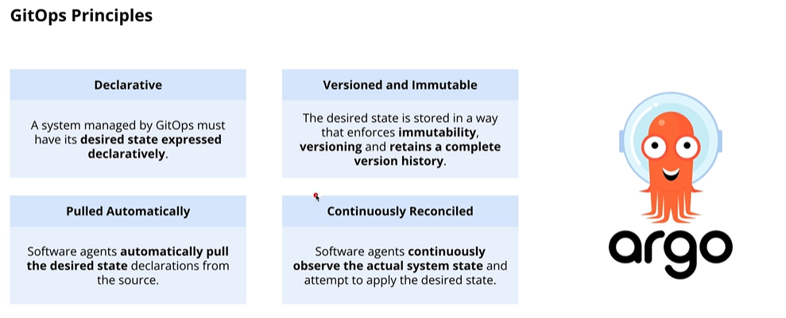
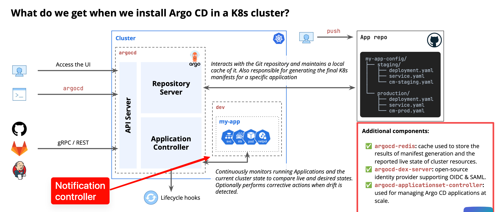
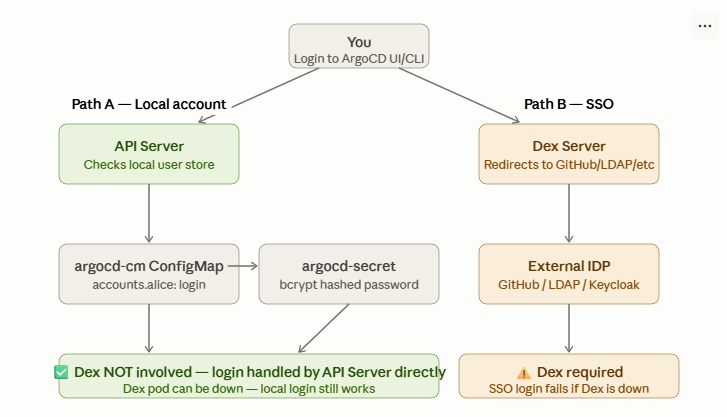
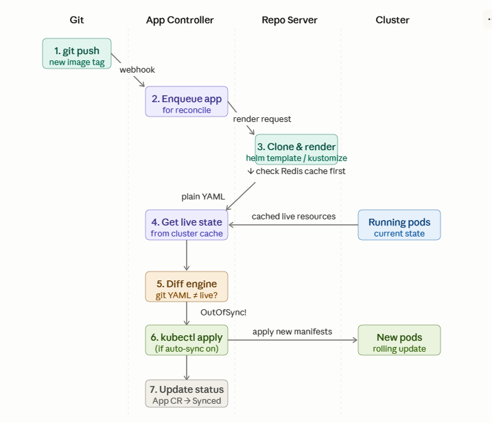
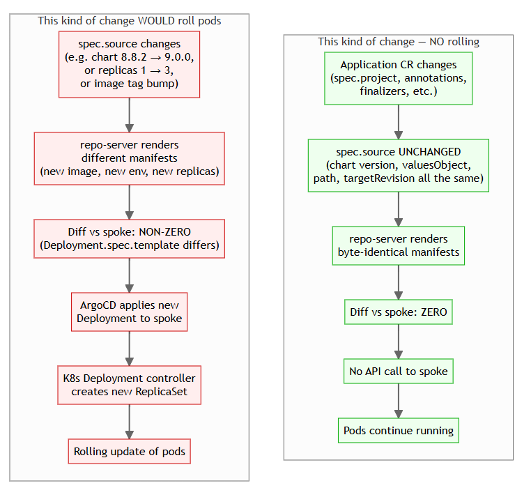
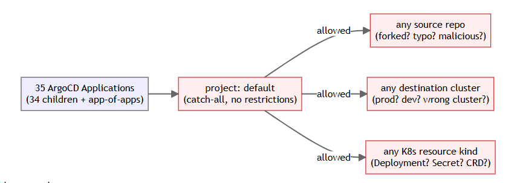
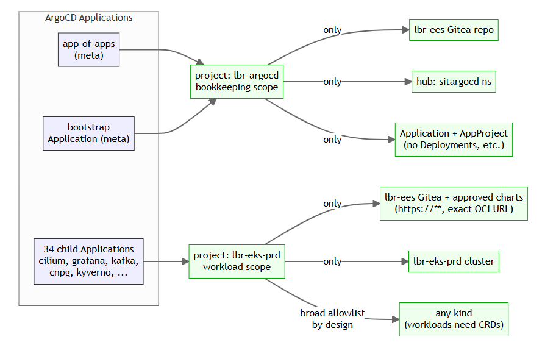

# ArgoCD Overview

# Overview
- **Why it exists** — track config-drift, have auditability and easy rollbacks that fix traditional deployment flow
- **What it is** — Argo CD is a GitOps-based Continuous Delivery (CD) system for Kubernetes.
- **One-liner** — It continuously watches a Git repository and compares Desired state (Git) vs Actual state (cluster)
  then (if auto-sync is enabled) applies changes

# Core Building Blocks

### Traditional push model

- core disadvantage is config-drift, poor auditability, difficult rollbacks


### GitOps flow



### GitOps Principles



# ArgoCD Component



## 1.API Server — argocd-server
  - This pod is the only entry point. Everything else is internal, it just talks to the 
  other components.
  - Handles SSO / RBAC authentication
  - **Key point**: If argocd-server is down → you can't use the UI or CLI. But your apps keep running and syncing because the App Controller is a separate pod.

## 2.Repo Server — argocd-repo-server
  - Rendering manifests from git is expensive (clone repo, run helm template, run 
  kustomize build)
  - clones and caches Git repositories locally, and may use Redis for additional cached metadata/results.
  - **Key point**: Repo Server is stateless itself — all state lives in Redis or git. It can be restarted safely.

## 3.Redis — argocd-redis

  - Rendered manifest cache (Repo Server output, not repo it self)
  - Live cluster state cache
  - **Key point**: Redis is not persistent in default ArgoCD setup. If Redis restarts → cache is cold → first reconcile loop will be 
  slower, but nothing breaks.

## 4.Application Controller — argocd-application-controller

  - This is the brain. It runs the reconciliation loop. It must be isolated from API 
  traffic so nothing slows it down
### WHAT it does:
  1. Asks Repo Server: "Give me the rendered YAML for this app from git"
  2. Asks Kubernetes API: "What is currently running in the cluster for this app?"
  3. Diffs the two — this is the core engine
  4. If different and auto-sync on → make changes on your cluster
  5. Updates the Application CR status (Synced/OutOfSync, Healthy/Degraded)
  6. Repeats every 3 minutes by default (or immediately on git webhook)
   
- **Key point**: This is a StatefulSet (not a Deployment). It needs stable identity because it shards work across replicas in HA mode. When this restarts → no syncs happen until it comes back up.

## 5.ApplicationSet Controller — argocd-applicationset-controller

  - one ApplicationSet CR generates many Application CRs automatically.
  
### WHAT it does

1. Reads ApplicationSet CRs you define
2. Evaluates generators (List, Git directory, Cluster, Pull Request, etc.)
3. Renders each result through a template
4. Creates/updates/deletes Application CRs accordingly
5. Watches for changes — if you add a new cluster or git directory, it auto-creates the new Application

```yaml
# MOVE this to application noteeeeeeeeeeeeeeeeeeeeeeeeeeeeeeeeeeeeeeeeeeeeeeeeeeeeeeee
# One ApplicationSet → generates many Applications
apiVersion: argoproj.io/v1alpha1
kind: ApplicationSet
spec:
  generators:
  - git:
      repoURL: https://github.com/your/repo
      directories:
      - path: apps/*           # ← scans all folders under apps/
  template:
    metadata:
      name: '{{path.basename}}'   # ← becomes app name
    spec:
      source:
        path: '{{path}}'
      destination:
        namespace: '{{path.basename}}'
```

## 6.Notification Controller — argocd-notifications-controller

### WHAT it does

1. Watches all Application CR status changes in the Kubernetes API (which the App Controller updates)
2. Evaluates triggers — conditions custom define (e.g. "when sync fails", "when health becomes Degraded")
3. Renders a template (your custom message)
4. Sends the notification to configured services (Slack, email, etc.)

## 7.Dex Server — argocd-dex-server



   - it delegates identity authentication to an external provider (GitHub, Google, LDAP, SAML, Keycloak, etc.).
   - Dex is an OIDC identity broker — it sits between ArgoCD and your actual identity provider and translates whatever auth protocol they 
  speak into a standard OIDC token that ArgoCD understands.

# Full flow



# Rolling cause



# Project


