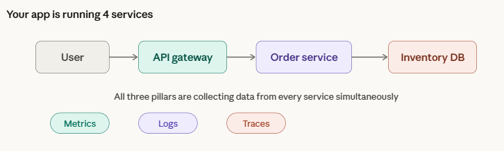
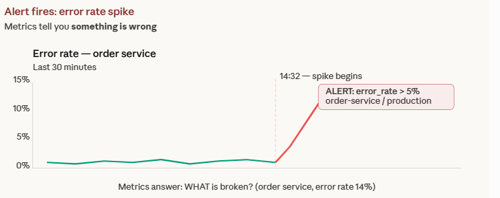
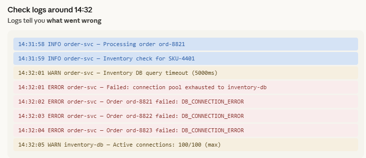
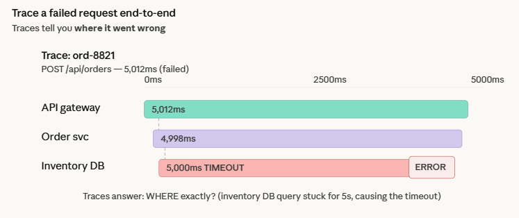

# Observability

- Observability is the ability to understand a system's internal state from its external outputs: metrics, logs, and traces.
- Collection agents scrape or receive telemetry from applications, store it in time-series or log databases, and surface it through dashboards and alerts.
- SLIs measure service health, SLOs set internal targets, and SLAs formalize commitments to users.

# Architecture

```text
                    +---------------------------+
                    |   Applications /          |
                    |   Infrastructure          |
                    +-----+------+------+-------+
                          |      |      |
                   metrics|  logs|  traces|
                          v      v      v
                    +---------------------------+
                    |  Collection Layer          |
                    |  (OTel Collector, Promtail,|
                    |   exporters, agents)       |
                    +-----+------+------+-------+
                          |      |      |
                          v      v      v
                    +---------------------------+
                    |  Kafka (optional buffer)   |
                    |  absorbs spikes, decouples |
                    |  producers from consumers  |
                    +-----+------+------+-------+
                          |      |      |
                          v      v      v
              +-----------+------+------+-----------+
              |           |             |            |
              v           v             v            v
        +---------+  +---------+  +---------+  +---------+
        |Prometheus|  |  Loki  |  |  Tempo  |  | Zabbix  |
        |(metrics) |  | (logs) |  |(traces) |  |(legacy) |
        +----+-----+  +----+---+  +----+----+  +----+----+
             |              |           |            |
             +---------+----+-----------+----+-------+
                       |                     |
                       v                     v
              +------------------+  +------------------+
              |    Grafana       |  |  Alertmanager /  |
              |  (visualization) |  |  notifications   |
              +------------------+  +------------------+
```

- Collection layer gathers telemetry from apps and infrastructure via pull (scrape) or push (OTLP, syslog).
- Storage backends are specialized per signal type: Prometheus for metrics, Loki for logs, Tempo for traces.
- Zabbix is a standalone platform (agent-based, SNMP) used in traditional/legacy infrastructure monitoring.
- Grafana unifies all backends into a single UI for dashboards, queries, and alerting.

Related notes: [Alloy/001-alloy-overview](./Alloy/001-alloy-overview.md)

# Modern Observability Stack (Grafana + Prometheus + Loki + Tempo + Kafka)

This is the recommended stack for Kubernetes environments. This section shows how they connect as a system.

### Stack Overview

- **Grafana** = UI — dashboards, alerts, search. Displays everything, stores nothing.
- **Prometheus** = metrics storage — collects numeric time-series (CPU %, request count, latency) by scraping `/metrics` endpoints every 15s.
- **Loki** = log storage — collects text log lines from apps via agents (Promtail/OTel). Indexes by labels, not full-text.
- **Tempo** = trace storage — collects distributed traces (a single request's journey across microservices). Stores spans linked by trace ID.
- **OpenTelemetry (OTel)** = collection layer — vendor-neutral SDK + collector that sends metrics, logs, and traces to the backends above.
- **Kafka** = data pipeline (optional) — message bus that buffers telemetry between producers (apps/agents) and consumers (Loki/Tempo) at high volume.

### How the Stack Connects

```text
Your Apps / K8s Cluster
        |
        |  OTel SDK or auto-instrumentation
        v
+---------------------+
| OpenTelemetry       |
| Collector           |
| (receive, process,  |
|  batch, export)     |
+--+-------+-------+--+
   |       |       |
   |       |       |         (optional, for high volume)
   |       |       |         +----------+
   |       |       +-------->|  Kafka   |---+
   |       |                 | (buffer) |   |
   |       |                 +----------+   |
   |       |                                |
   v       v                                v
+------+ +------+                      +--------+
|Prom  | |Tempo |                      | Loki   |
|(met) | |(trc) |                      | (logs) |
+--+---+ +--+---+                      +---+----+
   |        |                              |
   +--------+----------+-------------------+
                        |
                        v
                  +-----------+
                  |  Grafana  |
                  |  (query + |
                  |   display)|
                  +-----------+
```

### Data Types and Query Languages

| Signal  | Backend    | Query Language | Example                                            |
|---------|------------|----------------|----------------------------------------------------|
| Metrics | Prometheus | PromQL         | `rate(http_requests_total{status=~"5.."}[5m])`     |
| Logs    | Loki       | LogQL          | `{job="api"} \| json \| level="ERROR"`             |
| Traces  | Tempo      | TraceQL        | `{resource.service.name="api" && duration > 500ms}` |

### Correlation: The Real Power

- A **metric spike** in Grafana (Prometheus) tells you something is wrong.
- Click through to **logs** (Loki) filtered by the same service and time window to see error messages.
- From a log line with a **trace ID**, jump to **Tempo** to see the full request path across services.
- This metrics -> logs -> traces flow is the standard debugging workflow.

```text
Debugging flow:

[1] Dashboard alert fires (Prometheus metric breached)
     |
     v
[2] Grafana shows error rate spike on service "api"
     |
     v
[3] Switch to Explore -> Loki: {job="api"} | level="ERROR"
     |  -- find error message with trace_id=abc123
     v
[4] Switch to Explore -> Tempo: search trace_id=abc123
     |  -- see request flow: api -> auth -> db (db span = 5s timeout)
     v
[5] Root cause: database connection pool exhausted
```

### Suggested Learning and Deployment Order

1. **Prometheus + Grafana** — start here; see your cluster's CPU, memory, pods immediately
2. **Loki + Grafana** — add log search; replaces `kubectl logs` across all pods
3. **Tempo + Grafana** — add tracing; useful when you have multi-service apps
4. **OpenTelemetry** — unify collection; replace individual agents with one collector
5. **Kafka** — add last; only when direct ingestion becomes a bottleneck at scale

Related notes: [Prometheus/001-prometheus-overview](./Prometheus/001-prometheus-overview.md), [Logging/002-loki](./Logging/002-loki.md), [Tracing/001-tempo-overview](./Tracing/001-tempo-overview.md), [OpenTelemetry/001-opentelemetry-overview](./OpenTelemetry/001-opentelemetry-overview.md), [Kafka/001-kafka-overview](./Kafka/001-kafka-overview.md)

# Mental Model

```text
Observability workflow:

[1] Detect anomaly (alert fires / user reports issue)
     |
     v
[2] Check dashboard (Grafana / Zabbix)
     |  -- identify affected service, time window
     v
[3] Drill into metrics (PromQL query, rate/error/duration)
     |  -- narrow down to specific endpoint or host
     v
[4] Correlate with logs (Loki / Elasticsearch)
     |  -- search by timestamp, service, error pattern
     v
[5] Trace request (Jaeger / Tempo)
     |  -- follow trace ID across microservices
     v
[6] Identify root cause --> fix --> verify SLO recovery
```

```bash
# example: check error rate spike in Prometheus
curl -s 'http://prometheus:9090/api/v1/query?query=rate(http_requests_total{status=~"5.."}[5m])' | jq '.data.result'
```

# Core Building Blocks

### Three Pillars (Metrics, Logs, Traces)


- Metrics provide aggregated numeric data over time -- best for alerting and trend analysis.
- Logs capture discrete events with context -- best for debugging specific failures.
- Traces follow a single request across service boundaries -- best for understanding latency and dependencies.
- Three pillars of observability: metrics (aggregated numbers), logs (discrete events), traces (request flows).

Related notes: [Grafana/001-grafana-overview](./Grafana/001-grafana-overview.md), [Zabbix/001-zabbix-overview](./Zabbix/001-zabbix-overview.md)

### Metrics


- Time-series data points (timestamp + value + labels); types include counters, gauges, histograms, and summaries.
- Collection modes: pull/scrape (Prometheus scrapes /metrics endpoint) or push (application pushes to Pushgateway or StatsD).
- Stored in time-series databases (Prometheus, InfluxDB, VictoriaMetrics); queried with PromQL or similar.
- Prometheus uses a pull/scrape model; applications expose /metrics endpoints; PromQL is the query language.

Related notes: [Prometheus/001-prometheus-overview](./Prometheus/001-prometheus-overview.md)

### Logs


- Structured logs (JSON key-value) are easier to parse and query; unstructured logs (plain text) require pattern matching.
- Log aggregation pipelines collect, parse, and ship logs to central storage (Loki, Elasticsearch, Splunk).
- Search by timestamp, severity, service name, and keywords; correlate with trace IDs for cross-service debugging.
- Structured logs (JSON) are preferred over unstructured (plain text) for automated parsing and correlation.

Related notes: [Grafana/002-dashboards-queries](./Grafana/002-dashboards-queries.md)

### Traces


- Distributed tracing follows a request across microservices; each unit of work is a span with start time, duration, and metadata.
- A trace ID propagated in headers (e.g. W3C Trace Context) links all spans belonging to one request.
- Instrumentation via OpenTelemetry SDK or auto-instrumentation; backends include Jaeger, Tempo, and Zipkin.
- A trace is a tree of spans linked by a trace ID; each span represents one unit of work in a service.

Related notes: [Grafana/001-grafana-overview](./Grafana/001-grafana-overview.md)

### SLI / SLO / SLA

- SLI (Service Level Indicator): a measurable metric reflecting service health (e.g. request latency p99, error rate, availability).
- SLO (Service Level Objective): an internal target for an SLI (e.g. 99.9% availability over 30 days); triggers alerts when error budget is at risk.
- SLA (Service Level Agreement): a contractual commitment to users with consequences for violations; SLOs are stricter than SLAs to provide buffer.
- SLI = what you measure, SLO = what you target, SLA = what you promise to users.
- Error budget = 1 - SLO; when consumed, prioritize reliability over features.

Related notes: [Grafana/003-alerting](./Grafana/003-alerting.md)

### Monitoring and Alerting

- Monitoring continuously collects and visualizes metrics/logs; dashboards provide real-time and historical views.
- Alerting evaluates rules against thresholds or conditions and fires notifications when breached (e.g. CPU > 90% for 5m).
- Notification routing sends alerts to the right team via escalation policies (Alertmanager routes, Zabbix actions, PagerDuty schedules).

Related notes: [Grafana/003-alerting](./Grafana/003-alerting.md), [Zabbix/003-actions-templates](./Zabbix/003-actions-templates.md)

### Grafana

- Open-source visualization platform that connects to multiple data sources (Prometheus, Loki, Elasticsearch, Zabbix).
- Dashboards built from panels; each panel runs a query (PromQL, LogQL) and renders graphs, tables, or stat displays.
- Built-in alerting with contact points, notification policies, and silence/mute controls.
- Grafana connects to multiple backends (Prometheus, Loki, Elasticsearch, Zabbix) through data source plugins.

Related notes: [Grafana/001-grafana-overview](./Grafana/001-grafana-overview.md)

### Zabbix

- Enterprise monitoring platform with agent-based and agentless collection (SNMP, IPMI, JMX, HTTP checks).
- Data model: hosts hold items (data collectors), items feed triggers (threshold expressions), triggers fire actions (notifications/scripts).
- Supports low-level discovery (LLD), templates for reusable configurations, and distributed monitoring with proxies.
- Zabbix uses items to collect data, triggers to evaluate conditions, and actions to send notifications or run scripts.

Related notes: [Zabbix/001-zabbix-overview](./Zabbix/001-zabbix-overview.md)

---

# Troubleshooting Guide

### Service degradation or outage detected

1. Check alert details: which metric breached? which service? Grafana alert / Zabbix trigger.
2. Dashboard review: is it a spike or gradual trend? Grafana dashboard / Zabbix graphs.
3. Drill into metrics: error rate, latency, saturation? PromQL: `rate(http_requests_total{status=~"5.."}[5m])`.
4. Correlate with logs: errors around the same timestamp? Loki/Elasticsearch: filter by service + time range.
5. Trace the request: where does latency or failure occur? Jaeger/Tempo: search by trace ID from logs.
6. Infrastructure check: host resources, network, dependencies? Zabbix: CPU/memory/disk items, Prometheus: `node_exporter`.
7. Root cause identified, apply fix, verify SLO recovery.

# Topic Map

- [Prometheus/001-prometheus-overview](./Prometheus/001-prometheus-overview.md) — TSDB, scrape config, targets, service discovery, federation, PromQL
- [Prometheus/002-exporters-and-instrumentation](./Prometheus/002-exporters-and-instrumentation.md) — Node exporter, application instrumentation, custom exporters, Pushgateway
- [Prometheus/003-alertmanager](./Prometheus/003-alertmanager.md) — Alert routing, grouping, inhibition, silences, receivers
- [Logging/001-logging-overview](./Logging/001-logging-overview.md) — Structured vs unstructured logs, log levels, log aggregation pipeline
- [Logging/002-loki](./Logging/002-loki.md) — Loki architecture, label-based indexing, LogQL, retention, Loki vs ELK
- [Logging/003-logql-deep-dive](./Logging/003-logql-deep-dive.md) — LogQL pipeline stages, label filters, metric queries from logs
- [Tracing/001-tempo-overview](./Tracing/001-tempo-overview.md) — Tempo architecture, trace storage, span discovery, Grafana integration
- [Tracing/002-traceql-deep-dive](./Tracing/002-traceql-deep-dive.md) — TraceQL structural queries, span filtering, resource/span attributes
- [OpenTelemetry/001-opentelemetry-overview](./OpenTelemetry/001-opentelemetry-overview.md) — OTel standard, OTLP, SDK, auto-instrumentation, collector concepts
- [Alloy/001-alloy-overview](./Alloy/001-alloy-overview.md) — Grafana Alloy collector, River syntax, component model, K8s deployment
- [Kafka/001-kafka-overview](./Kafka/001-kafka-overview.md) — Kafka in observability, broker/topic/partition, telemetry buffering
- [Grafana/001-grafana-overview](./Grafana/001-grafana-overview.md) — Dashboard, data source, panel, alert
- [Grafana/002-dashboards-queries](./Grafana/002-dashboards-queries.md) — Panels, queries, variables, transforms
- [Grafana/003-alerting](./Grafana/003-alerting.md) — Grafana alert rule, contact point, notification policy
- [Zabbix/001-zabbix-overview](./Zabbix/001-zabbix-overview.md) — Host, item, trigger, action
- [Zabbix/002-items-triggers](./Zabbix/002-items-triggers.md) — Item types, key, trigger expression
- [Zabbix/003-actions-templates](./Zabbix/003-actions-templates.md) — Action, escalation, templates, LLD
- [Zabbix/004-monitoring-patterns](./Zabbix/004-monitoring-patterns.md) — Agent/agentless, dependent items, preprocessing
