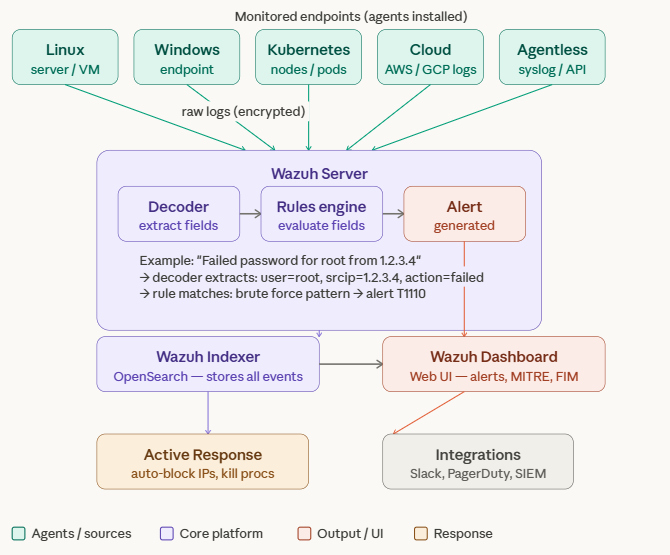
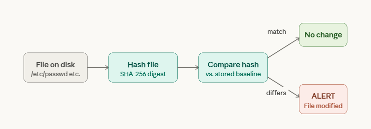
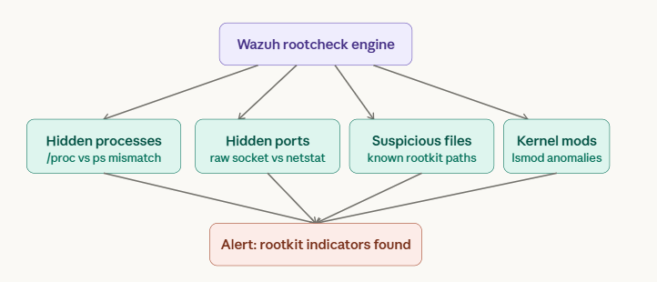
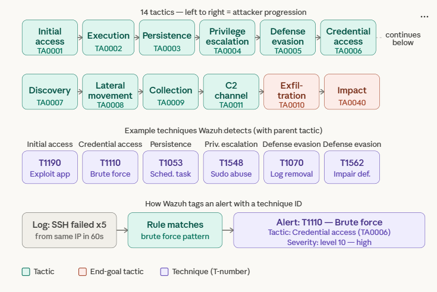

# Wazuh Overview
- **Why it exists** — Because logs alone are useless at scale. You can't manually read logs from 10+ servers. Wazuh ingests, normalizes, correlates, and rules-engines those logs into actionable alerts.
- **What it is** — Security monitoring platform specifically SIEM(Security Information & Event Management) + XDR(Extended Detection & Response)
- **One-liner** — Think of it as a central brain that collects security signals from your entire infrastructure, analyzes them, and alerts you to threats.

# Architecture
 

# Corebuilding Block

### Agent

- Runs on each endpoint, collects logs, file changes, process info
- push to wazuh Server to processing.

### Wazuh server 

- Decodes raw logs (extracts fields like IP, user, action) → Applies rules → Generates alerts
- raw logs are  unstructured noise, rules turn them into format and manageable.

### Decoder

- parse raw logs before rules evaluate them.

### Wazuh Indexer

- Store all events long-term, makes them searchable.
- store for historical data for auditing and compliance.
- stored data split into pieces called shards Splitting lets large indices be parallelized across
  multiple machines(if cluster)

### Wazuh Dashboard

- Web UI over the indexer (charts, alert tables)

### Active Response

- Run script on agent when rules trigger
- Automated containment ex.block an IP, kill proc
- use with caution can cause self-denial

# What Wazuh actually detect

### FIM (File Integrity Monitoring) 
- wazuh takes a crytographic hash(SHA-256) of a file
   On every scan, it rehashes and compares. If the hash differs, then alert.
   

### Vulnerability Detection 

- The Wazuh agent runs dpkg -l / rpm -qa to get your installed packages, sends the list to the server, which cross-references against the NVD (National Vulnerability Database) and OS-specific CVE feeds, then it recommend to upgrade version

### Log Analysis

- Raw logs are too noisy to read manually. Log analysis turns thousands of lines into a handful of meaningful alerts using rules.
- Detects Hidden process

Common detections:

| Log source | What Wazuh detects                               |
| ---------- | ------------------------------------------------ |
| sshd       | Brute force, invalid users, root login attempts  |
| sudo       | Privilege escalation, unexpected sudo usage      |
| auditd     | File access, command execution by specific users |
| systemd    | Service crashes, unexpected restarts             |

### Rootkit Detection
- Rootkits hide themselves — they modify the OS so that ls, ps, netstat lie to you. You can't trust the system's own tools once a rootkit is in.
- Wazuh bypasses the compromised OS layer by doing low-level checks directly.

### Compliance

- Regulations require you to prove your systems are hardened and audited.
  Manually checking 200+ controls per server is impossible.
- Wazuh has a built-in SCA (Security Configuration Assessment) module. It runs policy files (YAML-based checklists) against your system and scores each control as pass/fail.
- Detects Config failures.

### MITRE ATT & CK Mapping

- **The problem it solves:** Before ATT&CK existed, every security vendor described attacks differently. One called it "lateral movement", another called it "network pivoting". There was no common language. Defenders couldn't share threat intel efficiently.
- **What MITRE did:** They studied thousands of real-world attacks and categorized every technique attackers actually use into a structured matrix. Now when someone says "T1110", every security tool, team, and vendor knows exactly what that means.

The 3-level hierarchy — Tactic → Technique → Sub-technique

| Level         | Example                       | What it means                     |
| ------------- | ----------------------------- | --------------------------------- |
| Tactic        | Credential Access             | The attacker's goal at this stage |
| Technique     | T1110 — Brute Force           | How they achieve that goal        |
| Sub-technique | T1110.001 — Password guessing | The specific method used          |

- So when Wazuh fires an alert, you see all three levels. You know not just what happened, but why the attacker did it and what they're likely to do next.