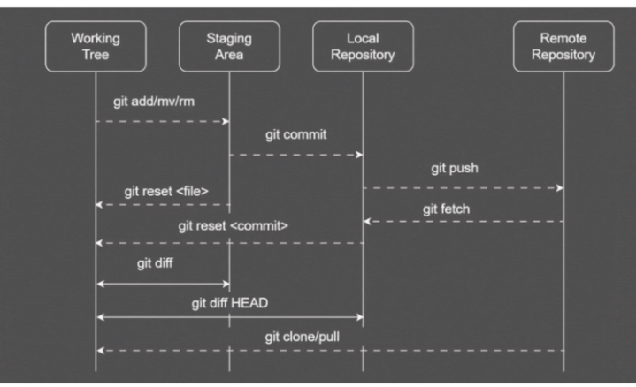

1. Advance commit
    - `git commit -am "commit message"` stages and commits all modified tracked files (does NOT include untracked files).
    - It won't worked for new file (untracked) must add them first.
    - `git commit --amend` rewrites the most recent commit (creates a new
         commit with a new hash). Use when add missing file or update commit message
        can use with `git add` first (only local!!).
2. Delete and Rename
    - `git rm <file>` removes file from Working Directory and stages the
         deletion. 
    - `git mv old new` renames or moves files within repo.
3. DIFF
    - `git diff` show different working directory vs staging area "what changed but not staged".
    - `git diff --staged` show different staging area vs last commit "what to be commit".
4. Discard unstaged change
    - `git restore <file>` restores file in Working Directory from Index. 
    - `git restore --sourec=HEAD <file>` restores file in Working Directory
         from HEAD commit.
5. Git reset
    - `git reset <file>` remove staged files from staging area.
    - `git reset <hash_commit>` moves current branch pointer to specified 
        commit may affect Index and Working Directory depending on mode (use local only!!).
6. Git revert
    - `git revert <hash_commit>` to create a new commit that cancels the 
        specified one.
    - This can keep consistent without deleting commits.
# Diagram
