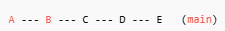
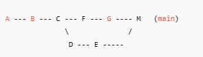

# GIT Branch

### What are Git branches

- A movable pointer to a commit that represents an independent line of
  development

### Why to use branches

- To **isolate** work without breaking the main project.
- Allows experimentation that can be merged when stable or discard easily.


### Command

```bash
git branch
```

- Lists all branches in the repository.

```bash
git branch <name>
```

- Creates a new branch at the current commit.

```bash
git branch -d <name>
```

- safely removes merged branches. `-D` forces delete.
  
```bash
git switch <name>
```

- Switches to the specified branch and updates the working directory.

### Merge

```bash
git merge <name>
```

- Combines another branch into the current one.

#### Merge Type

- **Fast-forward merge** happen when the target branch has no new commits since 
    the feature branch was created.

    - This only moves the branch pointer to the latest commit of the merged branch.
    - **No merge commit is created**.

Situation


Merge Result



- **Three way merge** happens when both branches have new commits after diverging.
    
    - **Creates a new merge commit** with two parents in 
      example from E and G
    - Git compares three commits: the common ancestor, the HEAD of the 
      target branch, and the HEAD of the merging branch.
    - May result in a **merge conflict**.
  
Situation


Merge Result




  