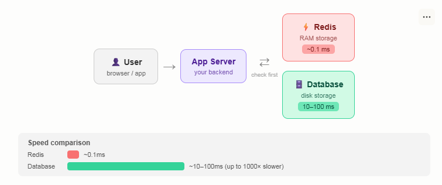
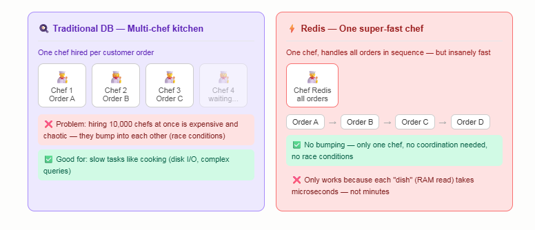
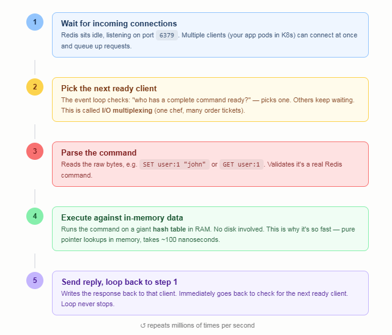
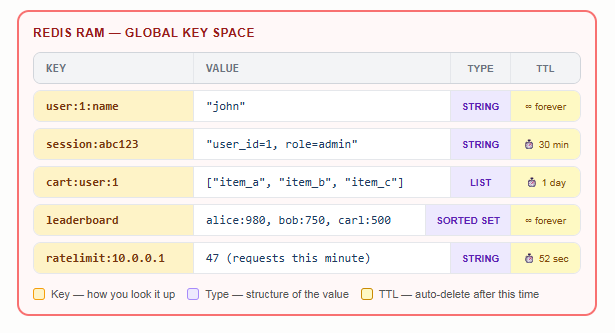
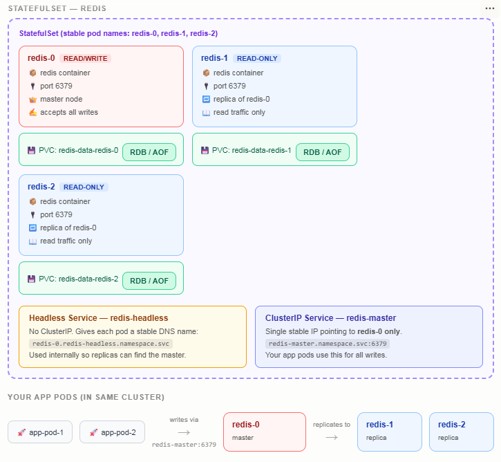

# What is Redis

|                  | Redis                   | Traditional DB (MySQL/Postgres) |
| ---------------- | ----------------------- | ------------------------------- |
| Where data lives | RAM (memory)            | Disk                            |
| Speed            | ~0.1ms                  | ~10–100ms                       |
| Data size        | Limited by RAM          | Virtually unlimited             |
| Primary use      | Cache, sessions, queues | Long-term records               |
| Data loss risk   | Yes (if not configured) | No                              |

- Redis is a database that store in RAM making it extremely fast 
- User → App Server → checks Redis first (fast) → falls back to Database (slow) if not found
- `Redis = fast temporary storage`

  
### The problem it solves

- Think about a regular database like MySQL or PostgreSQL. Every time your app needs data, it goes to the hard disk, reads it, sends it back. That takes ~10–100 milliseconds.
- That sounds fast, but:
  - A webpage might make 50+ database queries
  - You might have 10,000 users at once
  - Disk reads add up fast
- The insight: Some data is read over and over — like a user's profile, a product page, today's top posts. Why hit the slow disk every single time?
  Redis solves this by keeping data in RAM, where reads take ~0.1ms. It acts as a fast "first stop" before your slow database.

### Primary use 
  - Cache — store expensive query results temporarily so you don't re-run them
  - Sessions — keep track of who's logged in ("user 123 is authenticated")
  - Rate limiting — "this IP made 100 requests in 1 minute, block it"
  - Queues — a list of background jobs waiting to be processed

## Normal work

- Single-threaded (One command runs at a time, no parallel execution)

## Redis flow

- Event loop (One loop picks up requests, executes, replies, repeats)

## Hash table 

- how data ctually lives in RAM
- All data is a giant dictionary in RAM

# why need statfulset

The core problem: Redis is stateful, K8s was built for stateless
Before the diagram — the key mental shift:

|               | Stateless app (your API)    | Redis (stateful)                                |
| ------------- | --------------------------- | ----------------------------------------------- |
| Pod dies?     | Spin up new one, no problem | Data in RAM is gone                             |
| Pod restarts? | Fine, no memory             | Needs to reload from disk or replica            |
| Scale up?     | Just add pods               | Need replication, not just copies               |
| Pod identity? | Doesn't matter              | Matters — master vs replica are different roles |

This is why you cannot use a Deployment for Redis in production. You need StatefulSet

### StatefulSet (not Deployment)

- Gives pods stable, predictable names: redis-0, redis-1, redis-2 — always, even after restart
- Pods start and terminate in order — redis-0 always comes up first (becomes master), replicas after
- Each pod gets its own PVC that follows it — redis-data-redis-0 is always attached to redis-0

### Two service

| Service        | Type                    | Purpose                                                                        |
| -------------- | ----------------------- | ------------------------------------------------------------------------------ |
| redis-headless | Headless (no ClusterIP) | DNS for pod-to-pod discovery — replicas find master via redis-0.redis-headless |
| redis-master   | ClusterIP               | Stable endpoint for your app to write to — always points to redis-0            |

### PVC per pod

- Each pod has its own PersistentVolumeClaim — survives pod restarts
- Stores Redis's persistence files (RDB snapshot or AOF log)
- On EKS this maps to an EBS volume per pod, in the same AZ